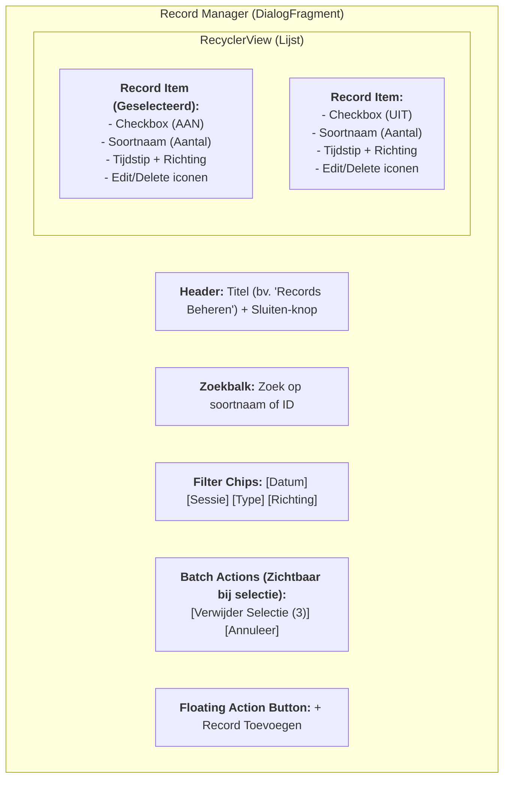

# Record Manager UI Mockup

Hieronder zie je het visuele ontwerp voor de herbruikbare `RecordManagerFragment`. Dit ontwerp is gebaseerd op de bestaande "Dark UI" stijl van VoiceTally (donkere achtergronden, blauwe accenten).

## Schermopbouw

## Details per element:

1.  **Header**: Toont de context (bv. "Telling: 20240619").
2.  **Zoekbalk**: Real-time filtering terwijl je typt.
3.  **Filter Chips**: Sneltoetsen om de lijst te beperken (bv. alleen 'terugvliegend' of een specifieke soortgroep).
4.  **Record Item**:
    *   **Links**: Checkbox voor batch-selectie.
    *   **Midden**: Belangrijkste info (Soort, Aantal, Tijd).
    *   **Rechts**: Directe actie-knoppen voor individuele bewerking.
5.  **Batch balk**: Verschijnt onderaan zodra er 1 of meer items geselecteerd zijn. Toont het aantal geselecteerde records en een rode verwijder-knop.

## Dark Theme Kleurenpalet:
- **Achtergrond**: `#121212` (Deep Black/Gray)
- **Kaarten/Items**: `#1E1E1E` (Dark Surface)
- **Accent**: `#2196F3` (Material Blue)
- **Error/Delete**: `#CF6679` (Soft Red)

> [!NOTE]
> De UI zal zich automatisch aanpassen aan de schermgrootte (bijv. breder op tablets).

---

Voldoet deze opzet aan uw verwachtingen, of wilt u specifieke velden (zoals 'leeftijd' of 'geslacht') directer in de lijst zien?
