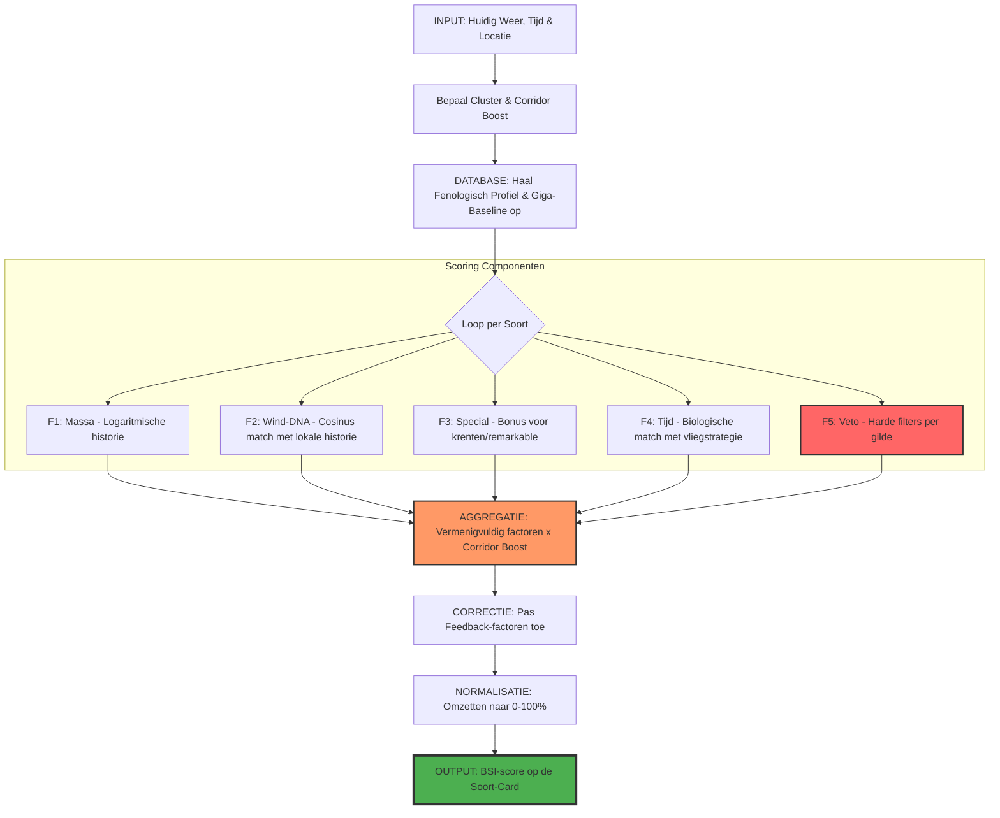

# BSI-Training Audit: Het Collectieve Geheugen (v2.0)

Dit document beschrijft de 8-staps workflow die wordt geactiveerd bij een tik op de knop **[BSI-TRAINING]** (voorheen AI Trainen). Dit proces vormt de brug tussen de ruwe historische data en de snelle, visuele intelligentie van de app.

## 1. De Trainings-Workflow

### Stap 1: Inventarisatie van de "Hersenomvang"
De app scant de database (`waarnemingen`) op alle unieke soort-ID's. Dit bepaalt de architectuur van het neurale netwerk: elke soort krijgt zijn eigen unieke set "hersencellen" om patronen aan te koppelen.

### Stap 2: Ervaringen laden (`neural_engine.bin`)
Bestaande wiskundige gewichten worden ingeladen. Dit bestand bevat de geaccumuleerde kennis van eerdere trainingen, waardoor de AI niet bij elke sessie volledig vanaf nul hoeft te beginnen.

### Stap 3: Data-reconstructie (Featurization)
De zwaarste berekening: alle historische records worden geanalyseerd op:
- **Tijdstip**: Exacte uur van waarneming.
- **Meteorologie**: Windrichting, windkracht, temperatuur, druk en neerslag.
- **Astronomie**: De zonnestand (Solar Phase) op dat specifieke moment.
Deze data wordt omgezet in wiskundige vectoren ("Training Samples").

### Stap 4: Neuraal Leerproces (Backpropagation)
De `LiteNeuralEngine` verwerkt de samples. Bij elke "hit" (soort gezien) worden de statistische verbindingen tussen de condities en de soort versterken. Bij afwezigheid worden ze verzwakt. Dit proces herhaalt zich voor tienduizenden records totdat de patronen stabiel zijn.

### Stap 5: Meteorologische Vingerafdrukken
De `ExpertKnowledgeManager` berekent per soort de correlatie tussen piek-aantallen en specifieke windvectoren. Dit resulteert in een lokale "voorkeurswind" per soort voor jouw specifieke cluster.

### Stap 6: Genereren Wetenschappelijke Taxonomie
De `TaxonomyManager` kruist de actieve database met de wereldwijde `species.json`. Soorten worden ingedeeld in gilden (bijv. Watervogels, Roofvogels) en opgeslagen in `active_scientific_taxonomy.json` voor gebruik in de weergave.

### Stap 7: Proactieve Beelden-Archivering
De app scant op ontbrekende foto's voor soorten in je archief. Thumbnails worden proactief gedownload en opgeslagen als blobs in de `species_images` database-tabel voor offline gebruik.

### Stap 8: De Scientific Vault Verzegelen (HD-Curves)
Als laatste stap wordt de `species_phenology_vault` tabel gevuld:
- **HD-Curves**: De 366-daagse trek-intensiteit per soort wordt berekend.
- **Piek-Analyse**: Het voorjaars- en najaarsvenster wordt vastgesteld op basis van de 50%-maximum drempelwaarde.

---

## 2. Opslaglocaties & Formaten

| Component | Bestand/Tabel | Locatie | Formaat |
| :--- | :--- | :--- | :--- |
| **AI Gewichten** | `neural_engine.bin` | `VT5/AI-models/models/` | Binair |
| **AI Controle** | `neural_engine.json` | `VT5/AI-models/models/` | JSON (Leesbaar) |
| **Lokale Kennis** | `expert_knowledge.json` | `VT5/AI-models/models/` | JSON |
| **Taxonomie** | `active_scientific_taxonomy.json` | `VT5/AI-models/models/` | JSON |
| **Trek-curves** | `species_phenology_vault` | Room DB (`voicetally.db`) | SQLite Tabel |
| **Vogel-foto's** | `species_images` | Room DB (`voicetally.db`) | SQLite (Blob) |

---

## 3. Het Scoring-Mechanisme: Verhogers & Verlagers
De BSI-score (waarschijnlijkheid in %) is het resultaat van een wiskundige kettingreactie van lokale en regionale factoren.

### Factoren die de score VERHOGEN:
- **DNA-Match**: De huidige windrichting komt exact overeen met de historische "vingerafdruk" van de soort in jouw cluster.
- **Corridor Boost**: Gunstige meteorologische condities op de referentiepunten 48-72 uur voorafgaand aan de telling.
- **Fenologisch Hoogtepunt**: De teldag valt exact op de historische piekdag van de soort.
- **Strategisch Tijdstip**: De waarneming vindt plaats op het biologisch ideale uur voor de betreffende gilde.

---

## 4. BSI-Scoring Flowchart
Onderstaande flowchart visualiseert de techniek waarmee de BSI-score per soort wordt berekend:

### Interactieve Mermaid Flowchart:

### Visuele Referentie:

---
> [!IMPORTANT]
> De AI gebruikt **pure statistiek** om deze factoren te wegen. Er is geen sprake van "fantasie": elke score is herleidbaar naar een historisch patroon uit een 23-jarige archief.
