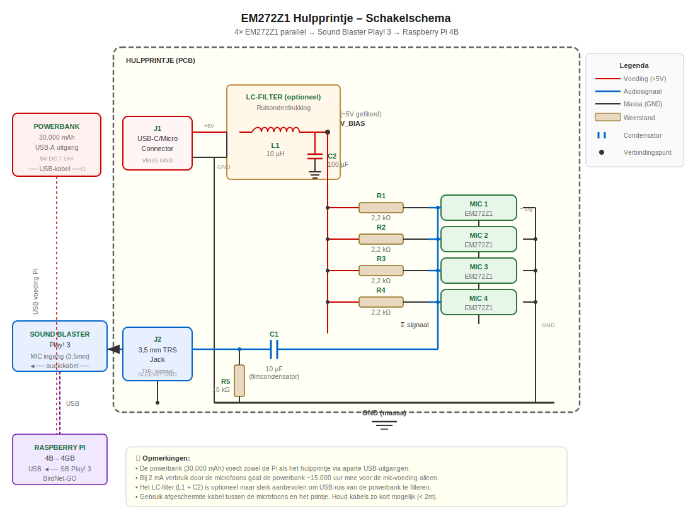
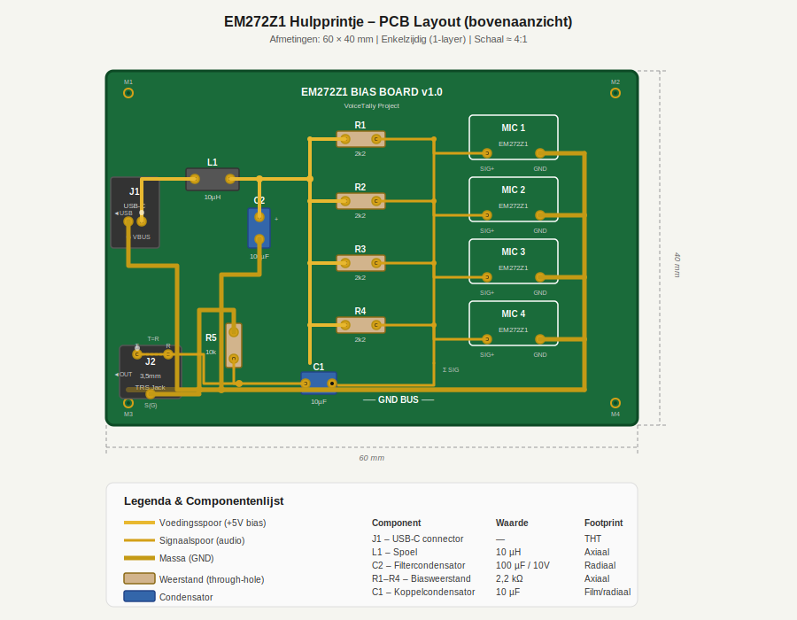

# EM272Z1 Microfoon Setup Guide

## Doel

Vier **Primo EM272Z1** electretmicrofoons parallel aansluiten op een **Sound Blaster Play! 3** (USB-geluidskaart), geoptimaliseerd voor ruisarme opnames van overvliegende vogels tijdens de voor- of najaarsmigratie. Het audiosignaal wordt via USB gestreamd naar een **Raspberry Pi 4B (4 GB)** en geanalyseerd met **BirdNet-GO**.

---

## 1. De EM272Z1 – Kerngegevens

| Parameter | Waarde |
|---|---|
| Type | Electret condensator (back-electret) |
| Voedingsspanning (bias) | 2 V – 10 V |
| Stroomverbruik per capsule | ca. 0,5 mA |
| Gevoeligheid | −28 dB re 1 V/Pa (typ.) |
| Equivalent ingangsnoise | 14 dBA (typ.) – uitzonderlijk laag |
| Max SPL | 120 dB SPL |
| Impedantie uitgang | ca. 2,2 kΩ |

De EM272Z1 is een van de stilste electretcapsules op de markt en daarmee uitermate geschikt voor het opnemen van zwakke vogelsignalen op afstand.

---

## 2. De Sound Blaster Play! 3 – Plug-in Power

De Sound Blaster Play! 3 levert **plug-in power (PiP)** op de 3,5 mm microfooningang:

- **Spanning:** ca. **2,0 V – 2,5 V** DC bias via een interne weerstand (typisch 2,2 kΩ).
- **Stroom:** De beschikbare biasstroom is beperkt (typisch 0,5 – 1,0 mA totaal).

### Kan de Play! 3 vier capsules voeden?

Vier EM272Z1 in parallel verbruiken samen ca. **4 × 0,5 mA = 2 mA**. De interne biasweerstand van de Play! 3 (≈ 2,2 kΩ) laat bij 2,5 V slechts ~1,1 mA door. Dat is **niet voldoende** voor vier capsules.

> ⚠️ **Conclusie:** Je hebt een **externe voedingsbron** (biasbron) nodig om de vier microfoons correct te voeden.

---

## 3. Schakeling – Vier EM272Z1 parallel met externe bias

### 3.1 Principe

Elke EM272Z1 heeft twee aansluitdraden:
- **Signaal/voeding (+)** — de "hot" draad
- **Massa (GND)** — de "ground" draad

De capsule heeft een ingebouwde FET die zowel de biasspanning als het audiosignaal over dezelfde draad vervoert. We moeten:

1. De bias **extern** aanleveren via een geschikte weerstand.
2. Het DC-component blokkeren richting de geluidskaart met een koppelcondensator.
3. De vier signalen samenvoegen (parallel).

### 3.2 Schema

```
           Externe voeding
           (3V – 9V DC)
               │
               │
        ┌──────┴──────┐
        │              │
       [R1]          [R2]          [R3]          [R4]
       2,2kΩ         2,2kΩ         2,2kΩ         2,2kΩ
        │              │              │              │
        ├──[EM272Z1]   ├──[EM272Z1]   ├──[EM272Z1]   ├──[EM272Z1]
        │   #1    │    │   #2    │    │   #3    │    │   #4    │
        │        GND   │        GND   │        GND   │        GND
        │              │              │              │
        └──────┬───────┘──────┬───────┘──────┬───────┘
               │              │              │
               └──────┬───────┘──────────────┘
                      │
                     [C1]
                    10 µF
                  (elektrolytisch
                  of MLCC film)
                      │
                      ├─────────────► TIP  (signaal) ──► 3,5 mm jack
                      │                                    naar SB Play! 3
                     [R5]                                  mic-ingang
                    10 kΩ
                      │
                     GND ──────────► SLEEVE (massa) ──► 3,5 mm jack
```

### 3.3 Componentenlijst

| Component | Waarde | Aantal | Toelichting |
|---|---|---|---|
| **R1 – R4** | 2,2 kΩ (metaalfilm, 1%) | 4 | Biasweerstand per capsule |
| **C1** | 10 µF (elektrolytisch of filmcondensator) | 1 | DC-blokkering (koppelcondensator) |
| **R5** | 10 kΩ | 1 | Ontladingsweerstand / bias-drain naar GND voor de geluidskaart-ingang |
| **Voeding** | 3 V – 5 V DC (batterij of USB) | 1 | Externe biasspanning |
| **3,5 mm TRS-stekker** | Mono (TS) of Stereo (TRS) | 1 | Aansluiting op SB Play! 3 |
| **EM272Z1** | — | 4 | Electretcapsules |

### 3.4 Gedetailleerde uitleg

#### Biasweerstand (R1–R4): 2,2 kΩ per capsule

- Elke capsule krijgt zijn **eigen** biasweerstand. Dit garandeert dat elke capsule voldoende stroom krijgt en voorkomt interactie tussen de capsules.
- Bij 5 V voeding: I = (5 V − ~0,7 V FET) / 2200 Ω ≈ **2 mA per capsule** — ruim voldoende.
- Bij 3 V (2× AA-batterij): I ≈ 1 mA — nog steeds voldoende.

#### Koppelcondensator (C1): 10 µF

- Blokkeert de DC-biasspanning zodat alleen het audiosignaal (AC) naar de geluidskaart gaat.
- Met de 10 kΩ ontladingsweerstand geeft dit een laagste grensfrequentie van:
  - f = 1 / (2π × 10 kΩ × 10 µF) ≈ **1,6 Hz** — ver onder het relevante bereik voor vogelgeluiden.

#### Ontladingsweerstand (R5): 10 kΩ

- Geeft een DC-pad naar GND voor de ingang van de geluidskaart.
- Voorkomt "ploppen" bij het aansluiten en stabiliseert het werkpunt.

#### Waarom NIET de PiP van de SB Play! 3 gebruiken?

- De plug-in power van de Play! 3 levert onvoldoende stroom voor 4 capsules.
- De koppelcondensator (C1) blokkeert de bias van de kaart sowieso — de kaart "ziet" alleen het AC-audiosignaal.

---

## 4. Externe voeding – Opties

### Optie A: Batterijvoeding (aanbevolen voor minimale ruis)

- **2× AA-batterij (3 V)** of **3× AA (4,5 V)** in een batterijhouder.
- Voordeel: volledig geïsoleerd van digitale ruis van de Pi/USB.
- Nadeel: batterijen moeten vervangen/opgeladen worden.

### Optie B: USB 5V van de Raspberry Pi

- Tap 5 V af van een USB-poort of de GPIO-header van de Pi (pin 2 of 4 = 5 V, pin 6 = GND).
- Voordeel: geen aparte voeding nodig.
- Nadeel: USB/digitale ruis kan in het signaal lekken.
- **Tip:** Plaats een **LC-filter** (10 µH spoel + 100 µF condensator) op de 5 V-lijn om hoogfrequente ruis te onderdrukken:

```
  5V (Pi) ──[10µH spoel]──┬── naar R1-R4
                           │
                        [100µF]
                           │
                          GND
```

### Optie C: Powerbank (aanbevolen ✅)

- Gebruik een **aparte USB-uitgang** van dezelfde powerbank (30.000 mAh) die ook de Raspberry Pi voedt.
- Sluit een USB-kabel aan op het hulpprintje (USB-C of Micro-B connector → J1 op het PCB).
- De powerbank levert 5 V DC — meer dan voldoende voor 4 capsules (slechts ~2 mA nodig).
- **Levensduur microfoon-voeding:** 30.000 mAh / 2 mA = **~15.000 uur** (ruim 600 dagen!) — de Pi verbruikt het overgrote deel.
- Fysiek gescheiden USB-uitgang = minder kans op digitale ruis in het audiosignaal.
- **Tip:** Gebruik het **LC-filter** (L1 + C2) op het hulpprintje om eventuele schakelruis van de powerbank te filteren.

> 💡 **Aanbeveling:** Gebruik **optie C (powerbank)** — dit is de meest praktische oplossing. Je hebt de powerbank al, het verbruik is verwaarloosbaar, en met het LC-filter op het hulpprintje is de ruisonderdrukking uitstekend.

### 📐 Schakelschema

Zie het volledige schakelschema van het hulpprintje:

👉 **[EM272Z1-hulpprintje-schema.svg](EM272Z1-hulpprintje-schema.svg)**



### 🔲 PCB Layout

De PCB-layout toont de fysieke plaatsing van componenten en kopersporen op het hulpprintje (60 × 40 mm, enkelzijdig):

👉 **[EM272Z1-hulpprintje-pcb-layout.svg](EM272Z1-hulpprintje-pcb-layout.svg)**



---

## 5. Tips voor ruisvrije opnames

### 5.1 Bekabeling

- Gebruik **afgeschermde kabel** (bv. miniatuur-coax of afgeschermde tweelitze) van de capsules naar het aansluitpunt.
- Houd kabels **zo kort mogelijk** (< 2 meter ideaal).
- Verbind alle afschermingen met GND op **één punt** (star-grounding) om grondlussen te vermijden.

### 5.2 Capsule-montage

- Monteer de capsules in een **windscherm** (bijv. kunstbont / "dead cat") om windruis te elimineren.
- Gebruik **rubberen ophangringen** of schuim om trilruis (handling noise) te dempen.
- Richt de capsules **omhoog** (naar de hemel) voor optimale opvang van overvliegende vogels.

### 5.3 Plaatsing van de array

- Verspreid de 4 microfoons over een **klein oppervlak** (30–50 cm onderlinge afstand) voor een iets breder opvangpatroon.
- Of monteer ze **dicht bij elkaar** (<5 cm) om als één enkele, gevoeligere microfoon te fungeren (coherente sommatie → +6 dB signaal bij 4 capsules, ruis stijgt slechts +3 dB → netto **+3 dB SNR-winst**).

### 5.4 Software-instellingen op de Raspberry Pi

- Stel de samplerate in op **48 kHz** (standaard voor BirdNet-GO).
- Gebruik **mono** opname (de 4 capsules worden al gemengd in het hardwarecircuit).
- Stel het microfoonvolume in via `alsamixer` — begin op **75-80%** en pas aan.
- Vermijd AGC (Automatic Gain Control) — dit kan artefacten introduceren.

```bash
# Controleer of de SB Play! 3 herkend wordt
arecord -l

# Test opname (48kHz, 16-bit, mono)
arecord -D hw:1,0 -f S16_LE -r 48000 -c 1 test.wav

# Volume instellen
alsamixer -c 1
```

### 5.5 BirdNet-GO configuratie

- Zorg dat BirdNet-GO ingesteld staat op de juiste **audio-input device** (de Sound Blaster Play! 3).
- Stel de **confidence threshold** in op een geschikt niveau (bijv. 0,7) om valse positieven te beperken.
- Overweeg om **opnames te loggen** naast de analyses, zodat je achteraf kunt verifiëren.

---

## 6. Samenvatting – Wat heb je nodig?

| Item | Heb je al? | Opmerkingen |
|---|---|---|
| 4× EM272Z1 | ✅ | — |
| Sound Blaster Play! 3 | ✅ | — |
| Raspberry Pi 4B 4GB | ✅ | — |
| BirdNet-GO | ✅ | Software |
| 4× Weerstand 2,2 kΩ (metaalfilm) | ❌ | Biasweerstand per capsule |
| 1× Condensator 10 µF | ❌ | Koppelcondensator |
| 1× Weerstand 10 kΩ | ❌ | Ontladingsweerstand |
| Voeding 3–5V DC | ❌ | Batterijhouder of USB-aftap |
| 3,5 mm TRS-stekker | ❌ | Aansluiting op SB Play! 3 |
| Afgeschermde kabel | ❌ | Voor capsule-bedrading |
| Windscherm | ❌ | Kunstbont of foam |
| Optioneel: LC-filter (10µH + 100µF) | ❌ | Alleen bij USB-voeding |

---

## 7. Veelgestelde vragen

**V: Kan ik de vier capsules gewoon parallel zetten zonder individuele weerstanden?**
A: Dat kan, maar het is **niet aanbevolen**. Zonder individuele weerstanden delen de capsules één biasweerstand, waardoor ze elkaars werkpunt beïnvloeden. Dit kan leiden tot hogere ruis en verminderde stabiliteit.

**V: Waarom niet elk microfoon op een apart kanaal?**
A: De SB Play! 3 heeft slechts **één mono microfooningang**. Voor meerkanaals opname heb je een multi-input interface nodig (bijv. een 4-kanaals USB-recorder).

**V: Verlies ik geluidskwaliteit door 4 capsules parallel te zetten?**
A: Nee, integendeel. Coherente signalen (vogelgeluiden) worden **opgeteld** (+6 dB bij 4 capsules), terwijl ongekorreleerde ruis slechts met +3 dB toeneemt. Netto win je **~3 dB signaal-ruisverhouding**.

**V: Welke batterij gaat het langst mee?**
A: Met 4 capsules bij ~0,5 mA elk = 2 mA totaal. Een set van 2× AA-alkaline (2500 mAh) gaat dan **~1250 uur** (> 50 dagen) mee.

---

## 8. Referenties

- [Primo EM272 Datasheet](https://store.micbooster.com/primo-capsules/7-em272.html)
- [Sound Blaster Play! 3 Specificaties](https://us.creative.com/p/sound-blaster/sound-blaster-play-3)
- [BirdNet-GO GitHub](https://github.com/tphakala/birdnet-go)
- [Raspberry Pi 4B Documentatie](https://www.raspberrypi.com/products/raspberry-pi-4-model-b/)
