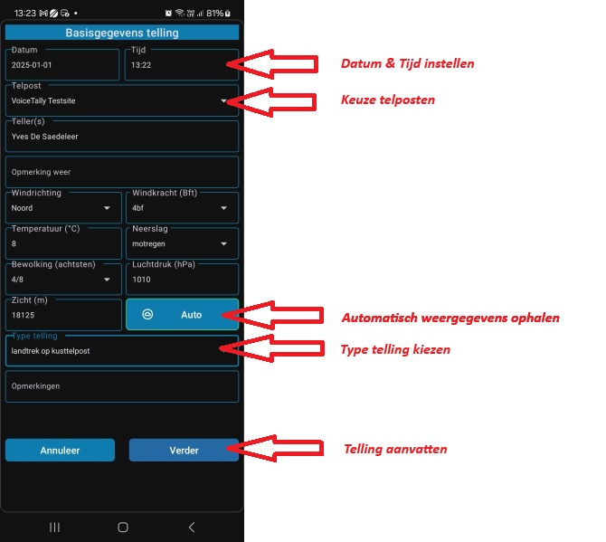
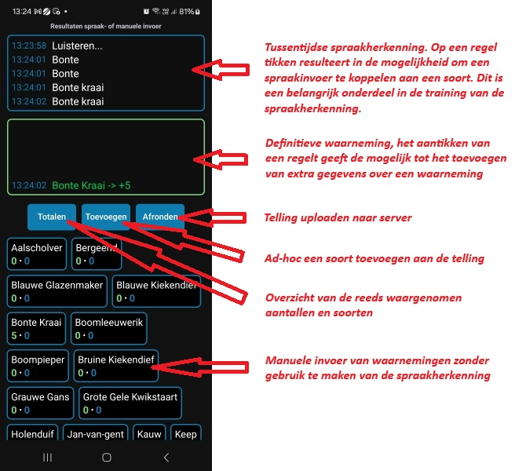

# Moderne Android-versies (vooral vanaf Android 12–14) en de aangepaste beveiligingslaag Samsung Knox op Samsung-toestellen tonen vaak waarschuwingen wanneer je een APK buiten de officiële store installeert. Dat is normaal gedrag van Google Play Protect en het systeem voor “Unknown Apps”.

Er zijn een paar legitieme manieren om die waarschuwingen te vermijden of te minimaliseren.

**1. “Install unknown apps” toestaan (meest standaard)**

Vanaf Android 8.0 Oreo gebeurt dit per app (bv. browser of file manager).
Stappen (Samsung One UI):
-> Ga naar Instellingen
-> Apps
-> Kies de app waarmee je de APK opent
-> bv. My Files (Bestanden), Google Chrome, of een andere file manager
-> Install unknown apps
-> Zet Allow from this source aan

Daarna kan je APK’s installeren zonder dat Android het blokkeert.

# VT5 — Gebruikershandleiding

> **VT5** is een snelle, intuïtieve Android-app voor het vastleggen van vogeltrekwaarnemingen via spraakinvoer. De app is ontworpen voor gebruik in het veld door vogelwaarnemers en synchroniseert automatisch met [www.trektellen.nl](https://www.trektellen.nl).
> 
## Releases

[](https://github.com/YvedD/VoiceTally/releases/latest/download/app-release-v1.0.1.apk)  
[](https://github.com/YvedD/VoiceTally/releases/latest/download/app-release-v1.0.1.apk)  

  
  
  
[](https://github.com/YvedD/VoiceTally/blob/main/LICENSE.md)  
  

---

## Bèta-Releases / Nightly builds

[](https://github.com/YvedD/VoiceTally/releases/download/VoiceTally_master_client_b%C3%A9ta_v1.0.0/VT5_master_client_beta.apk)  
[](https://github.com/YvedD/VoiceTally/releases/download/VoiceTally_master_client_b%C3%A9ta_v1.0.0/VT5_master_client_beta.apk)  

  
  
  
[](https://github.com/YvedD/VoiceTally/blob/main/LICENSE.md)  
  

Bèta-releases en nightly builds bevatten nieuwe functies en experimentele wijzigingen die nog in ontwikkeling zijn.  
Deze versies kunnen instabiel zijn en onverwachte fouten bevatten. Gebruik ze vooral voor testen en feedback.  
Problemen of suggesties kunnen gemeld worden via de GitHub issue tracker.


- **Changelog / Versiegeschiedenis:** zie [`CHANGELOG.md`](CHANGELOG.md)

---

## Inhoudsopgave

1. [Eerste Installatie](#1-eerste-installatie)
2. [Permissies Toekennen](#2-permissies-toekennen)
3. [SAF-map Kiezen](#3-saf-map-kiezen)
4. [Automatisch Aangemaakte Bestanden](#4-automatisch-aangemaakte-bestanden)
5. [Server Data Downloaden](#5-server-data-downloaden)
6. [Metadata Instellen](#6-metadata-instellen)
7. [Soorten Kiezen & Recente Soorten](#7-soorten-kiezen--recente-soorten)
8. [Waarneming Toevoegen via Tegels](#8-waarneming-toevoegen-via-tegels)
9. [Waarneming Toevoegen via Spraakinvoer](#9-waarneming-toevoegen-via-spraakinvoer)
10. [Waarneming Annoteren](#10-waarneming-annoteren)
11. [Alias Aanmaken (Spraakinvoer Opslaan)](#11-alias-aanmaken-spraakinvoer-opslaan)
12. [Soorten Toevoegen tijdens Telling](#12-soorten-toevoegen-tijdens-telling)
13. [Huidige Stand Scherm](#13-huidige-stand-scherm)
14. [Telling Afronden](#14-telling-afronden)
15. [Auto-Weather Systeem](#15-auto-weather-systeem)
16. [Samenwerken met Meerdere Toestellen (Master-Client)](#16-samenwerken-met-meerdere-toestellen-master-client)

---

## 1. Eerste Installatie

### Stap 1: App Starten
Na het installeren van de APK start u de VT5-app. U komt terecht op het **Hoofdscherm** met zes knoppen:

| Knop | Functie |
|------|---------|
| **(Her)Installatie** | Opent het installatieproces voor eerste configuratie of herconfiguratie |
| **Invoeren telpostgegevens** | Start een nieuwe telling (na installatie) |
| **Toggle alarm** | Schakelt het uurlijkse alarm in/uit |
| **Bewerk tellingen** | Mogelijkheid om bestaande tellingen nog aan te passen en op te slaan |
| **Opkuis submap 'exports'** | Opschonen van de submap exports op de tien laatste bestanden na |
| **Instellingen** | Stel een aantal gebruikersinstellingen in met betrekking tot de interface |

### Stap 2: Installatiewizard Starten
Klik op **"(Her)Installatie"** om naar het `InstallatieScherm` te gaan.

---

## 2. Permissies Toekennen

VT5 vraagt om de volgende permissies:

| Permissie | Waarvoor nodig |
|-----------|----------------|
| **Microfoon** (`RECORD_AUDIO`) | Spraakherkenning voor het invoeren van waarnemingen |
| **Locatie** (`ACCESS_FINE_LOCATION`, `ACCESS_COARSE_LOCATION`) | Auto-weather functie: ophalen van actuele weergegevens |
| **Opslagtoegang** (via SAF) | Bestanden opslaan en laden in `Documents/VT5/` |
| **Alarm** (`SCHEDULE_EXACT_ALARM`) | Uurlijks alarm op de 59e minuut |
| **Trillen** (`VIBRATE`) | Feedback bij alarmmeldingen |

De app vraagt deze permissies automatisch aan wanneer ze nodig zijn.

---

## 3. SAF-map Kiezen

### Wat is SAF?
SAF (Storage Access Framework) is het moderne opslagsysteem van Android. U kiest zelf de map waar VT5 bestanden mag opslaan.

### Stappen:
1. In het `InstallatieScherm`, klik op **"Kies Documents map"**
2. Android toont een bestandskiezer
3. Navigeer naar uw **Documents**-map (of maak deze aan)
4. Klik op **"Gebruiken"** of **"Toestaan"**
5. De status verandert naar: *"SAF OK - Alle mappen aanwezig"*

### Mappen Controleren/Aanmaken
Klik op **"Controleer/Maak mappen"** om te verifiëren dat alle submappen bestaan:
- `Documents/VT5/assets/`
- `Documents/VT5/serverdata/`
- `Documents/VT5/counts/`
- `Documents/VT5/exports/`
- `Documents/VT5/binaries/`

---

## 4. Automatisch Aangemaakte Bestanden

Na het configureren van SAF maakt VT5 de volgende structuur aan:

```
Documents/VT5/
├── assets/                          # Master data & configuratie
│   ├── alias_master.json           # Alle aliassen (soortnaam-synoniemen)
│   ├── alias_master.meta.json      # Metadata over de alias index
│   ├── alias_index.json            # Exportformaat van aliases
│   ├── annotations.json            # Annotatie-opties (leeftijd, geslacht, kleed)
│
├── binaries/                        # Geoptimaliseerde runtime bestanden
│   ├── aliases_optimized.cbor.gz   # Binaire alias-index (snel laden)
│   └── species_master.cbor.gz      # Soortenlijst (binair)
│
├── serverdata/                      # Gedownloade server data
│   ├── species.json                # Alle vogelsoorten
│   ├── site_species.json           # Soorten per telpost
│   ├── sites.json                  # Telposten/locaties
│   ├── codes.json                  # Weer- en overige codes
│   └── checkuser.json              # Gebruikersinfo na login
│
├── counts/                          # Opgeslagen tellingen
│   └── <timestamp>_count_<id>.json # Per telling een JSON-bestand
│
└── exports/                         # Exports & logs
    └── alias_precompute_log_<ts>.txt
```

---

## 5. Server Data Downloaden

### Inloggegevens Instellen
1. Vul uw **trektellen.nl gebruikersnaam** in bij "Login"
2. Vul uw **wachtwoord** in
3. Klik op **"Bewaar"** om de gegevens veilig op te slaan

### Login Testen
Klik op **"Test login"** om te verifiëren dat uw credentials werken. Bij succes ziet u uw gebruikersinfo.
Als je dit doet worden ook de gebruikergegevens lokaal opgeslagen zodat die later kunnen gebruikt worden voor de upload naar de server.

### Server Data Downloaden
1. Klik op **"Download JSONs van server"**
2. De app downloadt:
   - `species.json` — Alle vogelsoorten
   - `site_species.json` — Soorten per telpost
   - `sites.json` — Beschikbare telposten
   - `codes.json` — Weer- en overige codes

3. Automatisch wordt `annotations.json` aangemaakt in `assets/` met standaard annotatie-opties (leeftijd, geslacht, kleed) indien nog niet aanwezig

4. Na het downloaden wordt automatisch de **alias-index** bijgewerkt

### Alias Index Bijwerken
De alias-index wordt automatisch bijgewerkt na het downloaden van server data. U kunt handmatig een rebuild forceren via **"Forceer heropbouw alias index"**.

### Terug naar Hoofdscherm
Klik op **"Klaar"** om terug te keren naar het hoofdscherm.

---

## 6. Metadata Instellen

Het `MetadataScherm` is waar u de telling voorbereid voordat u begint met waarnemen.

### Scherm Openen
Klik op **"Invoeren telpostgegevens"** in het hoofdscherm.

### Velden Invullen

| Veld | Beschrijving |
|------|-------------|
| **Telpost** | Kies een telpost uit de dropdown (gedownload van server) |
| **Datum** | Automatisch ingevuld met vandaag; klik om aan te passen |
| **Starttijd** | Automatisch ingevuld met huidige tijd; klik om aan te passen |
| **Tellers** | Uw naam (automatisch ingevuld vanuit login), vul manueel aan met collega tellers |
| **Windrichting** | 16-punts kompasroos (N, NNO, NO, ONO, etc.) |
| **Windkracht** | Beaufort schaal (0-12) |
| **Bewolking** | Achtsten (0/8 tot 8/8) |
| **Neerslag** | Geen, motregen, regen, etc. |
| **Temperatuur** | Graden Celsius (C°)|
| **Zicht** | Meters |
| **Luchtdruk** | Hectopascal (hPa) |
| **Weer opmerking** | Vrij tekstveld voor extra weerinfo |

### Verder naar Soortselectie
Na het invullen van de metadata, klik op **"Verder"** om naar het soortenselectiescherm te gaan.
### Voorbeeld screenshot

---

## 7. Soorten Kiezen & Recente Soorten

Het `SoortSelectieScherm` toont alle beschikbare vogelsoorten voor uw telling.

### Schermindeling

```
┌───────────────────────────────────────┐
│ [Zoekbalk: Typ om te zoeken]          │
├───────────────────────────────────────┤
│ ═══ Recente Soorten (5) [✓] Alles ══  │ ← Header met "Selecteer alle recente"
│ ┌─────────┐ ┌─────────┐               │
│ │ Buizerd │ │ Koolmees│               │ ← Recent gebruikte soorten
│ └─────────┘ └─────────┘               │
│ ───────────────────────────────────── │ ← Scheidingslijn
│ ┌─────────┐ ┌─────────┐               │
│ │ Aalschol│ │ Appelvk │               │ ← Alfabetische lijst
│ └─────────┘ └─────────┘               │
│ ...                                   │
├───────────────────────────────────────┤
│ Totaal: 245 soorten | 12 geselecteerd │
│        [Annuleer]    [OK]             │
└───────────────────────────────────────┘
```

### Recente Soorten (Quick-Pick)
- **Bovenaan** ziet u de soorten die u recent heeft gebruikt
- Klik op **"Alles"** checkbox om alle recente soorten in één keer te selecteren
- Recente soorten worden automatisch bijgehouden (max. 30 items)

### Zoeken
- Typ in de zoekbalk om snel soorten te vinden
- Zoeken werkt op naam én ID
- De zoekfunctie is accent-insensitief ("e" vindt ook "é")

### Soorten Selecteren
- **Tik** op een soort om te selecteren/deselecteren
- Geselecteerde soorten krijgen een vinkje
- De teller onderaan toont hoeveel soorten zijn geselecteerd

### Bevestigen
Klik op **"OK"** om de selectie te bevestigen en naar het telscherm te gaan.

---

## 8. Waarneming Toevoegen via Tegels

In het `TellingScherm` ziet u uw geselecteerde soorten als tegels (tiles).

### Schermindeling

```
┌──────────────────────────────────────┐
│ ═══ Spraakherkenning Resultaten ═══  │
│ ┌──────────────────────────────────┐ │ ← Tussenstands spraakherkenning
│ │ [Partials - blauw kader]         │ │ ← Een lijn aantikken opent een popup scherm om een alias toe te voegen
│ └──────────────────────────────────┘ │
│ ┌──────────────────────────────────┐ │ ← Definitieve resultaten
│ │ [Finals - groen kader]           │ │ ← Een lijn aantikken opent een annotatiescherm voor die waarneming
│ └──────────────────────────────────┘ │
├──────────────────────────────────────┤ ← Actieknoppen [Overzicht van totalen tot nu toe]
│  [Totalen] [+ Soorten] [Afronden]    │ ← [Soort toevoegen][Uploaden naar server]
├──────────────────────────────────────┤
│ ┌─────────┐ ┌─────────┐ ┌─────────┐  │
│ │ Buizerd │ │ Sperwer │ │ Vink    │  │ ← Soort-tegels met aantallen naar beide richtingen
│ │ 3 . 12  │ │  0 . 0  │ │ 12 . 54 │  │ ← Een tegel aantikken opent een dialoog om handmatig aantallen toe te voegen
│ └─────────┘ └─────────┘ └─────────┘  │
│ ...                                  │
└──────────────────────────────────────┘
```

### Een alias toevoegen via de spraakinvoer/partialsscherm
1. **Tik** op een partials-lijn in het blauwe kader
2. Er verschijnt een dialoog: *"Alias toevoegen voor [partial-tekst]"*
3. Kies een soort om deze alias aan te toe te wijzen, tik op [Toevoegen]
4. Als de gebruiker een lijn kiest waarin ook een aantal is herkend, dan word dit aantal automatisch ingevuld bij de telling / tegel

### Een waarneming aanvullen, richting of andere parameters toevoegen via het finalscherm
1. **Tik** op een 'final-logregel' in het groene kader
2. Je komt terecht in het annotatiescherm, waarin verschillende parameters kunnen worden toegevoegd
3. Je kan ook waarnemingen splitsen over hoofdrichting, tegenrichting en lokaal
4. Er zijn ook checkboxen om de waarneming te markeren of in handteller-modus te zetten
5. Alle wijzigingen worden opgeslagen bij het tikken op [OK]

**Opmerking** Als je in het annotatiescherm aantallen ingeeft en tegelijk ook andere opties aantikt, dan gelden deze andere opties voor alle aantallen, dus ook voor 'tegenrichting' en 'lokaal' !!

### Knoppenbalk
**[Totalen]** : Toont een huidige stand van zaken van de **lopende** telling.<br>
**[Toevoegen]** : Extra soorten manueel toevoegen aan de lopende telling.<br>
**[Afronden]** : Sluit een lopende telling af en upload deze naar de server. (Nadien heb je de keuze om een vervolgtelling te maken).

### Uurlijks alarm
Op elke 59ste minuut van het begonnen uur verschijn het "Totalenscherm" met de huidige stand van zaken voor de lopende telling.<br>
Na controle is het aangeraden om de telling alsnog af te ronden en naar de server te sturen.<br>
Na het uploaden kan je kiezen om niet verder te tellen **[Annuleren] of een vervolgtelling te starten [OK].<br>

### Handmatig Tellen (Tik op Tegel)
1. **Tik** op een soort-tegel
2. Er verschijnt een dialoog: *"Voer aantal in voor [Soortnaam]"*
3. Typ het aantal (bijv. `5`)
4. Klik op **"OK"**
5. Het aantal wordt opgeteld bij de huidige telling

### Resultaat
- De tegel toont het nieuwe totaal
- In het **Finals-venster** verschijnt: `Buizerd -> +5`
- De telling wordt automatisch opgeslagen in een backup-bestand

### Voorbeeld screenshot

---

## 9. Waarneming Toevoegen via Spraakinvoer

VT5 is geoptimaliseerd voor snelle spraakherkenning van Nederlandse vogelnamen.

### Spraakherkenning Activeren
- **Volumetoets** (omhoog of omlaag) indrukken en loslaten
- Of automatisch via voice-key handler of een BT-HID knop

### Spraakprotocol
Spreek in het formaat: **"Soortnaam Aantal"**

| U zegt | Resultaat |
|--------|-----------|
| "Buizerd vijf" | Buizerd +5 |
| "Koolmees" | Koolmees +1 (impliciet 1) |
| "Wilde eend tien" | Wilde Eend +10 |
| "Vink twee" | Vink +2 |

### Nederlandse Getallen
VT5 herkent Nederlandse telwoorden:
- één, twee, drie, vier, vijf, zes, zeven, acht, negen, tien
- elf, twaalf, dertien, veertien, etc.
- twintig, dertig, veertig, vijftig, etc.

### Partials vs Finals
- **Partials** (blauw kader): Tussenresultaten terwijl u spreekt
- **Finals** (groen kader): Definitief herkende en geregistreerde waarnemingen

### Soort Niet in Tegels
Als u een soort noemt die niet in uw tegels zit:
1. VT5 toont een bevestigingsdialoog
2. *"Soort 'Wielewaal' herkend met aantal 2. Toevoegen?"*
3. Kies **"Ja"** om de soort toe te voegen, of **"Nee"** om te annuleren

### Suggestielijst
Bij onduidelijke herkenning toont VT5 een suggestielijst met kandidaten. Tik op de juiste soort om te selecteren.

### Tips
Sommige soorten zijn door de aard van Android Speech Recognition (hoofdzakelijk ontwikkeld voor een Engelstalig taalgebied) minder gemakkelijke te herkennen.
Soorten zoals 'fuut" worden vaak genegeerd omdat ze teveel lijken op het Engelse woord 'fu#@ck'.
Bij moeilijke soorten is het dan ook aangeraden om met verkleinwoorden te werken of meervouden "futen" - "sijsjes" - "kauwen".
Soorten waarvan de naam begint met een getal is ook niet altijd als dusdanig herkenbaar voor de spraakinvoer (denk aan "drieteenmeeuw" - "drieteenstrandloper") dit komt omdat het algoritme eerst een 'soortnaam' verwacht en pas daarna het aantal exemplaren.

---

## 10. Waarneming Annoteren

U kunt waarnemingen annoteren met extra details zoals leeftijd, geslacht, kleed, locatie en hoogte.

### Annotatiescherm Openen
1. **Tik** op een regel in het **Finals-venster** (groene kader)
2. Het `AnnotatieScherm` opent

### Beschikbare Annotaties

| Categorie | Opties |
|-----------|--------|
| **Leeftijd** | adult, 1e-kj, 2e-kj, 3e-kj, onbekend, etc. |
| **Geslacht** | man, vrouw, onbekend |
| **Kleed** | zomer, winter, overgangskleed, etc. |
| **Locatie** | over telpost, passend, rustend, etc. |
| **Hoogte** | < 10m, 10-50m, 50-100m, > 100m, etc. |
| **Markeren** | Speciale waarneming markeren |
| **Handteller** | Tally-telling modus |

### Aantallen Aanpassen
- **Hoofdrichting** (ZW of NO afhankelijk van seizoen - de periode wordt automatisch bepaald )
- **Tegenrichting**
- **Lokaal** (lokale vogels, niet trekkend)

### Kompas
- Er is een werkend kompas aanwezig, waarmee de gebruikers een afwijkende vliegroute precies kunnen ingeven, op basis van real-time kompas gegevens

### Opmerkingen
Veld voor vrije tekst (bijv. bijzondere kenmerken)

### Opslaan
Klik op **"OK"** om de annotatie op te slaan. De annotatie wordt gekoppeld aan de specifieke waarneming.

---

## 11. Alias Aanmaken (Spraakinvoer Opslaan)

Als VT5 een gesproken tekst niet herkent, kunt u deze als **alias** opslaan voor toekomstig gebruik.

### Wanneer Aliassen Gebruiken?
- Regionale namen ("ekster" vs "Euraziatische Ekster")
- Afkortingen ("bui" voor "Buizerd")
- Fonetische varianten ("koolmees" vs "koolmeest")

### Alias Aanmaken
1. **Tik** op een niet-herkende tekst in het **Partials-venster** (blauw kader)
2. Het `AddAliasDialog` opent
3. Kies de **gesproken tekst** (indien meerdere opties)
4. Selecteer de **doelsoort** via autocomplete
5. Klik op **"Toevoegen"**

### Resultaat
- De alias wordt opgeslagen in `alias_master.json`
- De alias-index (`aliases_optimized.cbor.gz`) wordt bijgewerkt
- Volgende keer wordt deze spraakvariant automatisch herkend

### Voorbeeld
```
Gesproken: "bui"
Gekoppeld aan: "Buizerd"

Volgende keer: "bui vijf" → Buizerd +5
```

---

## 12. Soorten Toevoegen tijdens Telling

U kunt extra soorten toevoegen terwijl een telling actief is.

### Soorten Toevoegen
1. Klik op **"+ Soorten"** in het telscherm
2. Het `SoortSelectieScherm` opent
3. Selecteer extra soorten
4. Klik op **"OK"**
5. De nieuwe soorten verschijnen als tegels in het telscherm

### Automatisch Toevoegen via Spraak
Als u via spraak een soort noemt die niet in de tegels zit, biedt VT5 aan om deze toe te voegen (zie sectie 9).

---

## 13. Huidige Stand Scherm

Het `HuidigeStandScherm` toont een overzicht van alle getelde soorten met hun aantallen.

### Scherm Openen
Klik op **"Totalen"** (of "Huidige stand") in het telscherm.

### Overzicht

```
┌────────────────────────────────────────────┐
│          Huidige Stand                     │
├────────────┬────────┬───────┬──────────────┤
│ Soortnaam  │ Totaal │  ZW   │     NO       │
├────────────┼────────┼───────┼──────────────┤
│ Buizerd    │   15   │  12   │      3       │
│ Sperwer    │    8   │   8   │      0       │
│ Vink       │  250   │ 200   │     50       │
│ ...        │  ...   │ ...   │    ...       │
├────────────┴────────┴───────┴──────────────┤
│ Totaal: 523 | ZW: 420 | NO: 103            │
│                                            │
│              [OK - Terug]                  │
└────────────────────────────────────────────┘
```

### Kolommen
- **Soortnaam**: Naam van de soort
- **Totaal**: Som van hoofdrichting + tegenrichting
- **ZW/NO**: Aantallen per richting (labels afhankelijk van seizoen)

### Seizoensafhankelijke Labels
- **ZW-seizoen** (juli-december): Hoofdkolom = "ZW", Terugkolom = "NO"
- **NO-seizoen** (januari-juni): Hoofdkolom = "NO", Terugkolom = "ZW"

### Terug naar Telling
Klik op **"OK"** om terug te keren naar het telscherm.

---

## 14. Telling Afronden
Op elke 00e minuut van het uur herinnert de app u eraan om een telling af te ronden via een alarmmelding (uitschakelbaar)
Na het voltooien van uw telling uploadt u de gegevens naar trektellen.nl.

### Afronden
1. Klik op **"Afronden"** in het telscherm
2. VT5 vraagt om bevestiging: *"Weet je zeker dat je wilt afronden?"*
3. Klik op **"Ja"** om te bevestigen

### Upload Proces
1. VT5 bouwt een `counts_save` envelope met:
   - Alle metadata (telpost, datum, tijd, weer)
   - Alle waarnemingen met annotaties
2. De envelope wordt geüpload naar trektellen.nl
3. Bij succes:
   - Lokale backup-bestanden worden opgeruimd
   - De telling wordt opgeslagen in `counts/` als archief
   - U keert terug naar het MetadataScherm
4. Na het uploaden kan men kiezen om een 'aansluitende' vervolgtelling te starten, om zo de tellingen verder te zetten.

### Foutafhandeling
- Bij netwerkfouten blijven de gegevens lokaal bewaard
- U kunt later opnieuw proberen via **"Afronden"**

### Archief
Afgeronde tellingen worden opgeslagen als:
```
Documents/VT5/counts/<timestamp>_count_<online_id>.json
```

---

## 15. Auto-Weather Systeem

VT5 kan automatisch actuele weergegevens ophalen via GPS en een weer-API.

### Functie Activeren
1. In het `MetadataScherm`, klik op **"Auto Weer"** (of wolk-icoon)
2. Bij eerste gebruik: sta locatiepermissie toe
3. VT5 haalt de huidige locatie op
4. Weergegevens worden automatisch ingevuld

### Automatisch Ingevulde Velden

| Veld | Bron |
|------|------|
| Windrichting | GPS + weer-API (16-punts kompas) |
| Windkracht | Windsnelheid omgezet naar Beaufort |
| Bewolking | Cloud cover % omgezet naar achtsten |
| Neerslag | Precipitation code |
| Temperatuur | Actuele temperatuur in °C |
| Zicht | Visibility in meters |
| Luchtdruk | Sea-level pressure in hPa |

### Na Auto-Weather
- De **"Auto Weer"** knop wordt blauw gekleurd
- De knop wordt uitgeschakeld (om dubbel ophalen te voorkomen)
- U kunt handmatig waarden aanpassen indien nodig

### Weer API
VT5 gebruikt de Open-Meteo API voor weergegevens (gratis, geen API-key nodig).

---

## 16. Samenwerken met Meerdere Toestellen (Master-Client)

> **Wat is de master-client modus?**
> Met deze functie kunnen twee of meer Android-toestellen tegelijkertijd aan dezelfde telling deelnemen via een gedeeld Wi-Fi-netwerk of mobiele hotspot. Eén toestel neemt de rol van **master** op zich: dit toestel beheert de telling, verzamelt alle waarnemingen en uploadt uiteindelijk alles naar trektellen.nl. De andere toestellen werken als **client**: zij sturen hun waarnemingen via het netwerk door naar de master.
>
> **Praktisch voorbeeld:** op een drukke telpost werken drie vogelaars. Toestel A is de master. Toestellen B en C zijn clients. Alles wat B en C inspreeken of intikken, wordt meteen doorgestuurd naar A. Alleen A doet de uiteindelijke upload.

---

### Overzicht van de drie modi

| Modus | Beschrijving |
|-------|-------------|
| **Solo** | Klassiek standalone gebruik — één toestel, geen netwerksamenwerking (standaard) |
| **Master** | Dit toestel is de "coordinator": het ontvangt waarnemingen van alle clients en uploadt ze |
| **Client** | Dit toestel stuurt zijn waarnemingen door naar de master |

---

### Vereisten

- Alle toestellen draaien VT5 en zijn **aangemeld met hun eigen trektellen.nl-account**.
- Alle toestellen bevinden zich op **hetzelfde lokale Wi-Fi-netwerk of dezelfde mobiele hotspot**.
- Een internetverbinding is **alleen vereist op het master-toestel** (voor de uiteindelijke upload).
- Op client-toestellen volstaat een verbinding met het lokale netwerk (intern Wi-Fi of hotspot).

> 💡 **Tip:** Als er geen extern Wi-Fi beschikbaar is, kan het master-toestel een **mobiele hotspot** activeren en de client-toestellen daarmee verbinden.

---

### Stap-voor-stap: Instelling vóór de telling

#### Op het master-toestel

1. Open VT5 en ga naar **Instellingen** (tandwiel-icoon op het Hoofdscherm).
2. Zoek het onderdeel **"Samenwerken (master-client)"**.
3. Kies **"Master"** en bevestig.
4. Ga terug naar het Hoofdscherm en start een telling via **"Invoeren telpostgegevens"** (metadata invullen zoals gewoonlijk).
5. Eenmaal in het telscherm: tik op de knop **"Clients"** (rechtsboven in de statusbalk).
6. Een venster verschijnt met een **PIN-code** (6 cijfers, geldig 10 minuten).
7. **Deel deze PIN-code mondeling of via berichtje** met de tellers op de client-toestellen.

> De PIN is 10 minuten geldig. Tik op **"Nieuwe PIN genereren"** als de code verlopen is voordat alle clients verbonden zijn.

#### Op elk client-toestel

1. Open VT5 en ga naar **Instellingen**.
2. Kies **"Client"** onder "Samenwerken (master-client)" en bevestig.
3. Ga terug naar het Hoofdscherm en start de telling (**"Invoeren telpostgegevens"** — vul dezelfde telpost en datum in als op de master).
4. Eenmaal in het telscherm: tik op de knop **"Koppelen met master"** (statusbalk onderaan).
5. Het koppelvenster verschijnt:
   - **IP-adres van de master** — vul dit in, of kies het master-toestel uit de lijst van **automatisch gevonden masters** die VT5 op het netwerk detecteert.
   - **PIN-code** — voer de 6-cijferige code in die u van de master gekregen heeft.
6. Tik op **"Verbinden"**.
7. Bij succes toont de statusbalk **"Client ▪ verbonden met master"**. U bent klaar om te tellen!

> 💡 **Hoe vind ik het IP-adres van de master?**
> Op het master-toestel: ga naar Android Instellingen → Wi-Fi → tik op het verbonden netwerk → noteer het "IP-adres" (bv. `192.168.43.1`). In de meeste gevallen detecteert VT5 de master automatisch in de lijst — handmatig invullen is zelden nodig.

---

### Tijdens de telling

- **Op client-toestellen:** gebruik de app zoals gewoonlijk — via spraakinvoer of door op tegels te tikken. Elke waarneming wordt automatisch en in real-time naar de master gestuurd.
- **Op het master-toestel:** waarnemingen van clients verschijnen in de tellog met het prefix **[C]** zodat u ze kunt onderscheiden van uw eigen invoer.
- **Statusbalk (master):** toont hoeveel clients er verbonden zijn, bv. `Master ▪ 2 client(s) verbonden`.
- **Statusbalk (client):** toont de verbindingsstatus, bv. `Client ▪ verbonden met master`.
- Als de verbinding kort wegvalt, slaat het client-toestel de nieuwe waarnemingen lokaal op en stuurt ze automatisch door zodra de verbinding hersteld is.

---

### Samenwerking beëindigen (normaal verloop)

#### Variant A — master rondt de telling af

1. De master tikt op **"Afronden"** in het telscherm.
2. VT5 verwerkt automatisch alle nog openstaande ("pending") waarnemingen van clients.
3. Na een succesvolle upload naar trektellen.nl vraagt de app:  
   *"Wil je een aansluitende vervolgtelling starten?"*
   - **"OK" (ja):** de master navigeert naar het MetadataScherm om een nieuwe telling te starten. De clients blijven verbonden.
   - **"Annuleren" (nee):** de master verlaat de telpost.  
     ➜ Als er clients verbonden zijn, ontvangen die automatisch het bericht **"Master verlaat de telpost"** (zie hieronder: *Master-overdracht*).

#### Variant B — master beëindigt de samenwerking handmatig

1. Tik in het telscherm op **"Beëindig samenwerking"** (in de statusbalk).
2. Een bevestigingsvenster verschijnt: *"Alle verbonden clients ontvangen een signaal dat de telling beëindigd is."*
3. Tik op **"Beëindigen"** om te bevestigen.
4. Alle clients ontvangen een melding en worden automatisch losgekoppeld.

#### Een client verlaat de telling zelf

1. De client tikt op **"Verlaat telling"** in de statusbalk.
2. Een bevestigingsvenster verschijnt: *"Wil je stoppen met tellen op deze telpost?"*
3. Tik op **"Verlaten"**.
4. De waarnemingen zijn al overgedragen aan de master; de client kan de app veilig sluiten of een solo-telling starten.

---

### Master-overdracht: één client neemt de masterfunctie over

**Wanneer gebeurt dit?**  
Als de master de telling succesvol afgerond heeft (alle pending records zijn ge-upload) en daarna kiest om **geen vervolgtelling** te starten, verlaat het master-toestel de telpost. De verbonden clients ontvangen dan automatisch een **master-overdracht** bericht.

**Hoe werkt het op het client-toestel?**

Een dialoogvenster verschijnt:

> **"Master verlaat de telpost"**  
> *"[naam master-toestel] heeft de telling afgerond en verlaat de telpost zonder een nieuwe telling te starten.*  
> *Wil jij de masterfunctie overnemen en een vervolgtelling starten?"*

- **"Ja, overnemen":**
  1. Het client-toestel schakelt automatisch naar **solo-modus** (het werkt nu zelfstandig, niet meer als client van de vorige master).
  2. De app navigeert naar het MetadataScherm met de eindtijd van de afgeronde telling al ingevuld als begintijd.
  3. Vul de overige metadata in en start de nieuwe telling. Dit toestel is nu de facto de nieuwe "coordinator" voor de vervolgtelling.
- **"Nee, niet overnemen":**
  1. Het toestel gaat terug naar het Hoofdscherm.
  2. Andere verbonden clients kunnen de overdracht nog accepteren.

> ⚠️ **Belangrijk:** de master-overdracht gebeurt **altijd ná** een succesvolle upload. U kunt er dus zeker van zijn dat geen enkel record verloren gaat op het moment van overdracht.

---

### Offline export en import (zonder netwerk)

Wanneer een client-toestel tijdelijk **geen verbinding** heeft (of nooit verbonden was):

1. **Op het client-toestel:**  
   Tik op **"Offline export"** in het telscherm.  
   VT5 exporteert alle lokaal opgeslagen waarnemingen als een JSON-bestand en biedt de optie om het te delen via Bluetooth, e-mail, bestandsbeheer, enz.

2. **Op het master-toestel:**  
   Tik op **"Offline import"**.  
   Selecteer het ontvangen JSON-bestand.  
   VT5 importeert de records en vermeldt hoeveel items zijn toegevoegd.

Deze methode werkt ook als alternatief voor de LAN-verbinding als de netwerkomgeving onbetrouwbaar is.

---

### Snel overzicht: knoppen en meldingen

| Knop / Melding | Waar | Betekenis |
|----------------|------|-----------|
| **Clients** | Master — statusbalk | Toon verbonden clients en de koppel-PIN |
| **Koppelen met master** | Client — statusbalk | Start het koppelproces |
| **Master ▪ N client(s) verbonden** | Master — statusbalk | Aantal actief verbonden clients |
| **Client ▪ verbonden met master** | Client — statusbalk | Verbinding actief en in orde |
| **Client ▪ verbinding maken…** | Client — statusbalk | Bezig met verbinden (even geduld) |
| **Client ▪ verbindingsfout** | Client — statusbalk | Verbinding verbroken; app probeert automatisch opnieuw |
| **Verlaat telling** | Client — statusbalk | Client verlaat de sessie netjes |
| **Beëindig samenwerking** | Master — statusbalk | Stuurt "sessie beëindigd" naar alle clients |
| **[C]** prefix in tellog | Master — telscherm | Waarneming afkomstig van een client |
| **Telling beëindigd door master** | Client — melding | Master heeft de samenwerking beëindigd |
| **Master verlaat de telpost** | Client — dialoogvenster | Master-overdracht: u kunt de masterfunctie overnemen |
| **Offline export** | Client — telscherm | Exporteer waarnemingen als JSON voor handmatige overdracht |
| **Offline import** | Master — telscherm | Importeer JSON-export van een client |

---

### Veelgemaakte fouten en oplossingen

| Probleem | Mogelijke oorzaak | Oplossing |
|----------|------------------|-----------|
| Client ziet de master niet in de lijst | Toestellen zitten op verschillende netwerken | Zorg dat alle toestellen op hetzelfde Wi-Fi of dezelfde hotspot zitten |
| "Koppeling mislukt" foutmelding | PIN verlopen of onjuist | Vraag de master om een nieuwe PIN te genereren en voer die opnieuw in |
| Statusbalk toont "verbindingsfout" | Wi-Fi/hotspot tijdelijk weg | VT5 probeert automatisch opnieuw; controleer netwerk als het lang duurt |
| Geen clients zichtbaar bij master | Clients hebben de modus nog niet ingesteld | Controleer of elk client-toestel in "Client-modus" staat én verbonden is met het netwerk |
| Waarnemingen van client ontbreken | Verbinding was verbroken tijdens invoer | Gebruik "Offline export" op de client en "Offline import" op de master |
| Master-overdracht dialog verschijnt niet | Master heeft "OK" gekozen (vervolgtelling gestart) of had geen clients | Overdracht-dialog verschijnt alleen bij "Annuleren" én als er clients verbonden zijn |

---

## Veelgestelde Vragen (FAQ)

### Q: De app start niet - wat nu?
**A:** Controleer of u alle permissies heeft toegekend. Ga naar Android Instellingen > Apps > VT5 > Permissies.

### Q: Spraakherkenning werkt niet
**A:** Controleer of microfoonpermissie is toegekend. Zorg voor een rustige omgeving voor betere herkenning.

### Q: Mijn soort wordt niet herkend
**A:** Maak een alias aan (zie sectie 11) of zoek de soort handmatig via de zoekfunctie.

### Q: Data is niet gesynced naar trektellen.nl
**A:** Controleer uw internetverbinding. Open de app en klik op "Afronden" om opnieuw te proberen.

### Q: Ik wil een telling annuleren
**A:** Sluit de app zonder op "Afronden" te klikken. De lokale data blijft bewaard. Gebruik de "Afsluiten" knop in het hoofdscherm voor een veilige afsluiting.

### Q: Moet elk toestel internetverbinding hebben in master-client modus?
**A:** Nee. Alleen het **master-toestel** heeft internet nodig voor de upload naar trektellen.nl. Client-toestellen hebben enkel een verbinding met het lokale Wi-Fi-netwerk of de mobiele hotspot nodig.

### Q: Kan ik ook samenwerken zonder Wi-Fi?
**A:** Ja, via de **offline export/import** functie (zie sectie 16). Het client-toestel exporteert een JSON-bestand met alle waarnemingen; de master importeert dat bestand handmatig.

### Q: Wat als de master de app afsluit terwijl er nog waarnemingen in de wachtrij staan?
**A:** VT5 garandeert dat alle openstaande ("pending") records volledig verwerkt en ge-upload zijn vóórdat het overdracht- of afsluit-bericht naar de clients wordt gestuurd. Er gaan dus geen records verloren.

### Q: Ik zie de master niet in de automatische lijst. Wat nu?
**A:** Controleer of beide toestellen op hetzelfde netwerk zitten. Voer indien nodig het IP-adres van de master handmatig in (te vinden via Android Instellingen → Wi-Fi → verbonden netwerk → IP-adres).

### Q: Kan een client de masterfunctie overnemen als de master vertrekt?
**A:** Ja. Zodra de master na een succesvolle upload kiest om geen vervolgtelling te starten, ontvangen alle verbonden clients een **"Master verlaat de telpost"** dialoog. Één client kan "Ja, overnemen" kiezen en wordt automatisch de nieuwe solo-coordinator voor de vervolgtelling.

---

## Technische Informatie

- **Minimale Android versie**: Android 13 (API 33)
- **Taalondersteuning**: Nederlands (primair)
- **Offline functionaliteit**: Kernfuncties werken zonder internet
- **Netwerk (master-client)**: lokaal Wi-Fi of mobiele hotspot; TCP poort 50234
- **Data opslag**: Android SAF (Documents/VT5/)
- **Backend**: www.trektellen.nl

---

## Contact & Support

Voor vragen of problemen, neem contact op met de app-ontwikkelaar.

---

*Versie: 1.0.1 | Laatste update: 2025-12-18*
