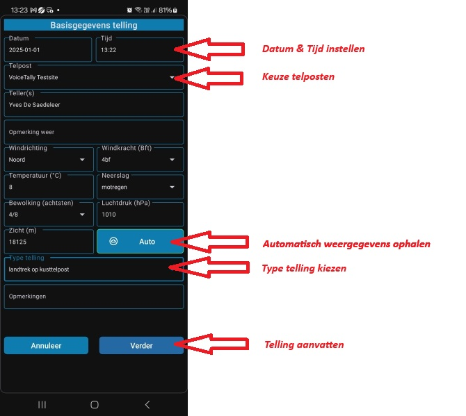
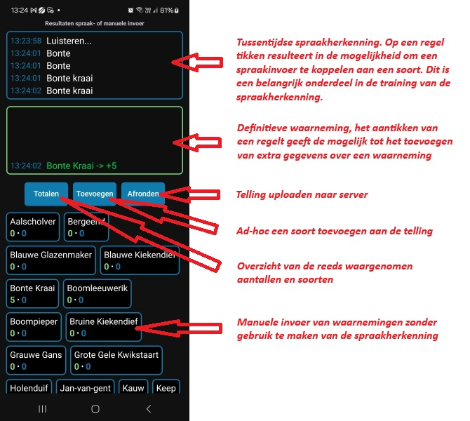

# Voor ontwikkelaars: zie [DEVELOPER.md](docs/DEVELOPER.md) voor build- en ontwikkelinstructies (Windows PowerShell, paden, BirdNET-info).

# Moderne Android-versies (vooral vanaf Android 12–14) en de aangepaste beveiligingslaag Samsung Knox op Samsung-toestellen tonen vaak waarschuwingen wanneer je een APK buiten de officiële store installeert. Dat is normaal gedrag van Google Play Protect en het systeem voor “Unknown Apps”.

# Moderne Android-versies (vooral vanaf Android 12–14) en de aangepaste beveiligingslaag Samsung Knox op Samsung-toestellen tonen vaak waarschuwingen wanneer je een APK buiten de officiële store installeert. Dat is normaal gedrag van Google Play Protect en het systeem voor “Unknown Apps”.

Er zijn een paar legitieme manieren om die waarschuwingen te vermijden of te minimaliseren.

**1. “Install unknown apps” toestaan (meest standaard)**

Vanaf Android 8.0 Oreo gebeurt dit per app (bv. browser of file manager).
Stappen (Samsung One UI):
-> Ga naar Instellingen
-> Apps
-> Kies de app waarmee je de APK opent
-> bv. My Files (Bestanden), Google Chrome, of een andere file manager
-> Install unknown apps
-> Zet Allow from this source aan

Daarna kan je APK’s installeren zonder dat Android het blokkeert.

# VT5 — Gebruikershandleiding

> **VT5** is een snelle, intuïtieve Android-app voor het vastleggen van vogeltrekwaarnemingen via spraakinvoer. De app is ontworpen voor gebruik in het veld door vogelwaarnemers en synchroniseert automatisch met [www.trektellen.nl](https://www.trektellen.nl).

## Latest Releases  
[](https://github.com/YvedD/VoiceTally/releases/download/Voicetally.5.version.1.0.3e.apk/Voicetally.5.-v1.0.3e.apk)


[](https://github.com/YvedD/VoiceTally/blob/main/LICENSE.md)


## Master / Client Pre-release
[](https://github.com/YvedD/VoiceTally/releases/download/mc_release-v1.0.0/mc-app-release.apk)


  


---

## Inhoudsopgave

1. [Eerste Installatie](#1-eerste-installatie)
2. [Permissies Toekennen](#2-permissies-toekennen)
3. [SAF-map Kiezen](#3-saf-map-kiezen)
4. [Automatisch Aangemaakte Bestanden](#4-automatisch-aangemaakte-bestanden)
5. [Server Data Downloaden](#5-server-data-downloaden)
6. [Metadata Instellen](#6-metadata-instellen)
7. [Soorten Kiezen & Recente Soorten](#7-soorten-kiezen--recente-soorten)
8. [Waarneming Toevoegen via Tegels](#8-waarneming-toevoegen-via-tegels)
9. [Waarneming Toevoegen via Spraakinvoer](#9-waarneming-toevoegen-via-spraakinvoer)
10. [Waarneming Annoteren](#10-waarneming-annoteren)
11. [Alias Aanmaken (Spraakinvoer Opslaan)](#11-alias-aanmaken-spraakinvoer-opslaan)
12. [Soorten Toevoegen tijdens Telling](#12-soorten-toevoegen-tijdens-telling)
13. [Huidige Stand Scherm](#13-huidige-stand-scherm)
14. [Telling Afronden](#14-telling-afronden)
15. [Auto-Weather Systeem](#15-auto-weather-systeem)
16. [AI 3-daagse Prognose & BpH Index](#16-ai-3-daagse-prognose--bph-index)
17. [AI Teldag Evaluatie (Sterrensysteem)](#17-ai-teldag-evaluatie-sterrensysteem)
18. [BirdNET-GO Integratie](#18-birdnet-go-integratie)
19. [Master / Client Samenwerking](#19-master--client-samenwerking)
20. [AI Optimalisatie & Zelflerend Brein](#20-ai-optimalisatie--zelflerend-brein)
21. [Database & Telpost Beheer](#21-database--telpost-beheer)
22. [Geavanceerde Instellingen](#22-geavanceerde-instellingen)

---

## 1. Eerste Installatie

### Stap 1: App Starten
Na het installeren van de APK start u de VT5-app. U komt terecht op het **Hoofdscherm** met zes knoppen:

| Knop | Functie |
|------|---------|
| **(Her)Installatie** | Opent het installatieproces voor eerste configuratie of herconfiguratie |
| **Invoeren telpostgegevens** | Start een nieuwe telling (na installatie) |
| **Toggle alarm** | Schakelt het uurlijkse alarm in/uit |
| **Bewerk tellingen** | Mogelijkheid om bestaande tellingen nog aan te passen en op te slaan |
| **Opkuis submap 'exports'** | Opschonen van de submap exports op de tien laatste bestanden na |
| **Instellingen** | Stel een aantal gebruikersinstellingen in met betrekking tot de interface |

### Stap 2: Installatiewizard Starten
Klik op **"(Her)Installatie"** om naar het `InstallatieScherm` te gaan.

---

## 2. Permissies Toekennen

VT5 vraagt om de volgende permissies:

| Permissie | Waarvoor nodig |
|-----------|----------------|
| **Microfoon** (`RECORD_AUDIO`) | Spraakherkenning voor het invoeren van waarnemingen |
| **Locatie** (`ACCESS_FINE_LOCATION`) | Auto-weather en AI-prognose (GPS-gebaseerd) |
| **Opslagtoegang** (via SAF) | Bestanden opslaan en laden in `Documents/VT5/` |
| **Camera** (`CAMERA`) | QR-code scannen voor Master/Client koppeling |
| **Bluetooth** (`BLUETOOTH_CONNECT`) | Gebruik van BT-HID knoppen (klik-afstandsbediening) |
| **Alarm** (`SCHEDULE_EXACT_ALARM`) | Uurlijks alarm op de 59e minuut |
| **Trillen** (`VIBRATE`) | Feedback bij alarmmeldingen en teller-interactie |

De app vraagt deze permissies automatisch aan wanneer ze nodig zijn.

---

## 3. SAF-map Kiezen

### Wat is SAF?
SAF (Storage Access Framework) is het moderne opslagsysteem van Android. U kiest zelf de map waar VT5 bestanden mag opslaan.

### Stappen:
1. In het `InstallatieScherm`, klik op **"Kies Documents map"**
2. Android toont een bestandskiezer
3. Navigeer naar uw **Documents**-map (of maak deze aan)
4. Klik op **"Gebruiken"** of **"Toestaan"**
5. De status verandert naar: *"SAF OK - Alle mappen aanwezig"*

### Mappen Controleren/Aanmaken
Klik op **"Controleer/Maak mappen"** om te verifiëren dat alle submappen bestaan:
- `Documents/VT5/assets/` — Configuratie & Master Aliassen
- `Documents/VT5/serverdata/` — Trektellen metadata (soorten, locaties)
- `Documents/VT5/counts/` — Opgeslagen tellingen (archief)
- `Documents/VT5/exports/` — Logs & tijdelijke exports
- `Documents/VT5/binaries/` — Geoptimaliseerde indexen (CBOR)
- `Documents/VT5/AI-models/` — Lokale AI modellen & training data
- `Documents/VT5/imports/` — Te importeren gegevens
- `Documents/VT5/logs/` — Applicatielogs voor debugging

---

## 4. Automatisch Aangemaakte Bestanden

Na het configureren van SAF maakt VT5 de volgende structuur aan:

```
Documents/VT5/
├── assets/                          # Master data & configuratie
│   ├── alias_master.json           # Alle aliassen (soortnaam-synoniemen)
│   ├── alias_master.meta.json      # Metadata over de alias index
│   ├── alias_index.json            # Exportformaat van aliases
│   ├── annotations.json            # Annotatie-opties (leeftijd, geslacht, kleed)
│
├── AI-models/                       # Lokale AI-intelligentie
│   ├── models/                     # Getrainde modellen (.json / .bin)
│   ├── training_exports/           # CSV exports van jouw waarnemingen
│   └── feedback/                   # Correcties op AI suggesties
│
├── binaries/                        # Geoptimaliseerde runtime bestanden
│   ├── aliases_optimized.cbor.gz   # Binaire alias-index (snel laden)
│   └── species_master.cbor.gz      # Soortenlijst (binair)
│
├── logs/                            # App-diagnostiek
│   └── vt5_app_log.txt             # Chronologisch logboek van app-acties
├── serverdata/                      # Gedownloade server data
│   ├── species.json                # Alle vogelsoorten
│   ├── site_species.json           # Soorten per telpost
│   ├── sites.json                  # Telposten/locaties
│   ├── codes.json                  # Weer- en overige codes
│   └── checkuser.json              # Gebruikersinfo na login
│
├── counts/                          # Opgeslagen tellingen
│   └── <timestamp>_count_<id>.json # Per telling een JSON-bestand
│
└── exports/                         # Exports & logs
    └── alias_precompute_log_<ts>.txt
```

---

## 5. Server Data Downloaden

### Inloggegevens Instellen
1. Vul uw **trektellen.nl gebruikersnaam** in bij "Login"
2. Vul uw **wachtwoord** in
3. Klik op **"Bewaar"** om de gegevens veilig op te slaan

### Login Testen
Klik op **"Test login"** om te verifiëren dat uw credentials werken. Bij succes ziet u uw gebruikersinfo.
Als je dit doet worden ook de gebruikergegevens lokaal opgeslagen zodat die later kunnen gebruikt worden voor de upload naar de server.

### Server Data Downloaden
1. Klik op **"Download JSONs van server"**
2. De app downloadt:
   - `species.json` — Alle vogelsoorten
   - `site_species.json` — Soorten per telpost
   - `sites.json` — Beschikbare telposten
   - `codes.json` — Weer- en overige codes

3. Automatisch wordt `annotations.json` aangemaakt in `assets/` met standaard annotatie-opties (leeftijd, geslacht, kleed) indien nog niet aanwezig

4. Na het downloaden wordt automatisch de **alias-index** bijgewerkt

### Alias Index Bijwerken
De alias-index wordt automatisch bijgewerkt na het downloaden van server data. U kunt handmatig een rebuild forceren via **"Forceer heropbouw alias index"**.

### Terug naar Hoofdscherm
Klik op **"Klaar"** om terug te keren naar het hoofdscherm.

---

## 6. Metadata Instellen

Het `MetadataScherm` is waar u de telling voorbereid voordat u begint met waarnemen.

### Scherm Openen
Klik op **"Invoeren telpostgegevens"** in het hoofdscherm.

### Velden Invullen

| Veld | Beschrijving |
|------|-------------|
| **Telpost** | Kies een telpost uit de dropdown (gedownload van server) |
| **Datum** | Automatisch ingevuld met vandaag; klik om aan te passen |
| **Starttijd** | Automatisch ingevuld met huidige tijd; klik om aan te passen |
| **Tellers** | Uw naam (automatisch ingevuld vanuit login), vul manueel aan met collega tellers |
| **Windrichting** | 16-punts kompasroos (N, NNO, NO, ONO, etc.) |
| **Windkracht** | Beaufort schaal (0-12) |
| **Bewolking** | Achtsten (0/8 tot 8/8) |
| **Neerslag** | Geen, motregen, regen, etc. |
| **Temperatuur** | Graden Celsius (C°)|
| **Zicht** | Meters |
| **Luchtdruk** | Hectopascal (hPa) |
| **Weer opmerking** | Vrij tekstveld voor extra weerinfo |

### Verder naar Soortselectie
Na het invullen van de metadata, klik op **"Verder"** om naar het soortenselectiescherm te gaan.
### Voorbeeld screenshot

---

## 7. Soorten Kiezen & Recente Soorten

Het `SoortSelectieScherm` toont alle beschikbare vogelsoorten voor uw telling.

### Schermindeling

```
┌───────────────────────────────────────┐
│ [Zoekbalk: Typ om te zoeken]          │
├───────────────────────────────────────┤
│ ═══ Recente Soorten (5) [✓] Alles ══  │ ← Header met "Selecteer alle recente"
│ ┌─────────┐ ┌─────────┐               │
│ │ Buizerd │ │ Koolmees│               │ ← Recent gebruikte soorten
│ └─────────┘ └─────────┘               │
│ ───────────────────────────────────── │ ← Scheidingslijn
│ ┌─────────┐ ┌─────────┐               │
│ │ Aalschol│ │ Appelvk │               │ ← Alfabetische lijst
│ └─────────┘ └─────────┘               │
│ ...                                   │
├───────────────────────────────────────┤
│ Totaal: 245 soorten | 12 geselecteerd │
│        [Annuleer]    [OK]             │
└───────────────────────────────────────┘
```

### Recente Soorten (Quick-Pick)
- **Bovenaan** ziet u de soorten die u recent heeft gebruikt
- Klik op **"Alles"** checkbox om alle recente soorten in één keer te selecteren
- Recente soorten worden automatisch bijgehouden (max. 30 items)

### Zoeken
- Typ in de zoekbalk om snel soorten te vinden
- Zoeken werkt op naam én ID
- De zoekfunctie is accent-insensitief ("e" vindt ook "é")

### Soorten Selecteren
- **Tik** op een soort om te selecteren/deselecteren
- Geselecteerde soorten krijgen een vinkje
- De teller onderaan toont hoeveel soorten zijn geselecteerd

### Bevestigen
Klik op **"OK"** om de selectie te bevestigen en naar het telscherm te gaan.

---

## 8. Waarneming Toevoegen via Tegels

In het `TellingScherm` ziet u uw geselecteerde soorten als tegels (tiles).

### Schermindeling

```
┌──────────────────────────────────────┐
│ ═══ Spraakherkenning Resultaten ═══  │
│ ┌──────────────────────────────────┐ │ ← Tussenstands spraakherkenning
│ │ [Partials - blauw kader]         │ │ ← Een lijn aantikken opent een popup scherm om een alias toe te voegen
│ └──────────────────────────────────┘ │
│ ┌──────────────────────────────────┐ │ ← Definitieve resultaten
│ │ [Finals - groen kader]           │ │ ← Een lijn aantikken opent een annotatiescherm voor die waarneming
│ └──────────────────────────────────┘ │
├──────────────────────────────────────┤ ← Actieknoppen [Overzicht van totalen tot nu toe]
│  [Totalen] [+ Soorten] [Afronden]    │ ← [Soort toevoegen][Uploaden naar server]
├──────────────────────────────────────┤
│ ┌─────────┐ ┌─────────┐ ┌─────────┐  │
│ │ Buizerd │ │ Sperwer │ │ Vink    │  │ ← Soort-tegels met aantallen naar beide richtingen
│ │ 3 . 12  │ │  0 . 0  │ │ 12 . 54 │  │ ← Een tegel aantikken opent een dialoog om handmatig aantallen toe te voegen
│ └─────────┘ └─────────┘ └─────────┘  │
│ ...                                  │
└──────────────────────────────────────┘
```

### Een alias toevoegen via de spraakinvoer/partialsscherm
1. **Tik** op een partials-lijn in het blauwe kader
2. Er verschijnt een dialoog: *"Alias toevoegen voor [partial-tekst]"*
3. Kies een soort om deze alias aan te toe te wijzen, tik op [Toevoegen]
4. Als de gebruiker een lijn kiest waarin ook een aantal is herkend, dan word dit aantal automatisch ingevuld bij de telling / tegel

### Een waarneming aanvullen, richting of andere parameters toevoegen via het finalscherm
1. **Tik** op een 'final-logregel' in het groene kader
2. Je komt terecht in het annotatiescherm, waarin verschillende parameters kunnen worden toegevoegd
3. Je kan ook waarnemingen splitsen over hoofdrichting, tegenrichting en lokaal
4. Er zijn ook checkboxen om de waarneming te markeren of in handteller-modus te zetten
5. Alle wijzigingen worden opgeslagen bij het tikken op [OK]

**Opmerking** Als je in het annotatiescherm aantallen ingeeft en tegelijk ook andere opties aantikt, dan gelden deze andere opties voor alle aantallen, dus ook voor 'tegenrichting' en 'lokaal' !!

### Knoppenbalk
**[Totalen]** : Toont een huidige stand van zaken van de **lopende** telling.<br>
**[Toevoegen]** : Extra soorten manueel toevoegen aan de lopende telling.<br>
**[Afronden]** : Sluit een lopende telling af en upload deze naar de server. (Nadien heb je de keuze om een vervolgtelling te maken).

### Uurlijks alarm
Op elke 59ste minuut van het begonnen uur verschijn het "Totalenscherm" met de huidige stand van zaken voor de lopende telling.<br>
Na controle is het aangeraden om de telling alsnog af te ronden en naar de server te sturen.<br>
Na het uploaden kan je kiezen om niet verder te tellen **[Annuleren] of een vervolgtelling te starten [OK].<br>

### Handmatig Tellen (Interactie met Tegels)
De tegels zijn de primaire manier om snel aantallen toe te voegen zonder spraak.

| Actie | Resultaat |
|-------|-----------|
| **Enkele Tik** | Voegt **+1** toe aan de hoofdrichting. |
| **Dubbele Tik** | Voegt een instelbaar aantal toe (standaard **+10**). |
| **Lange Druk** | Opent een numeriek toetsenbord voor exacte invoer. |

### Visuele Indicatoren op Tegels
- **Gekleurde randen**: Geven de status van de soort aan (bv. recent toegevoegd of gemarkeerd).
- **Richting-labels**: Toont de verdeling tussen hoofdrichting (links) en tegenrichting (rechts).
- **Handteller-modus**: Een icoon verschijnt wanneer een soort in de 'tally' modus staat voor snelle series.

### Resultaat
- De tegel toont de nieuwe totalen voor beide richtingen.
- In het **Finals-venster** verschijnt de logregel: `Buizerd -> +5`
- De telling wordt automatisch opgeslagen in het backup-bestand.

### Voorbeeld screenshot

---

## 9. Waarneming Toevoegen via Spraakinvoer

VT5 is geoptimaliseerd voor snelle spraakherkenning van Nederlandse vogelnamen.

### Spraakherkenning Activeren
- **Volumetoets** (omhoog of omlaag) indrukken en loslaten
- Of automatisch via voice-key handler of een BT-HID knop

### Spraakprotocol
Spreek in het formaat: **"Soortnaam Aantal [Richting]"**

| U zegt | Resultaat |
|--------|-----------|
| "Buizerd vijf" | Buizerd +5 (Hoofdrichting) |
| "Koolmees" | Koolmees +1 (Impliciet 1) |
| "Vink tien terug" | Vink +10 (**Tegenrichting**) |
| "Sperwer twee lokaal" | Sperwer +2 (**Lokaal**) |

### Richting-terug Aliassen
U kunt specifieke woorden aanleren die als "terug" of "tegenrichting" moeten worden geïnterpreteerd:
1. Spreek een zin uit zoals "Vink twee noord".
2. Tik op de regel in het blauwe venster waar "noord" in staat.
3. Koppel dit woord aan de speciale systeemsoort: **"Richting: Terug"**.
4. Voortaan zal elk getal dat gevolgd wordt door "noord" automatisch in de tegenrichting kolom verschijnen.

### Nederlandse Getallen
VT5 herkent Nederlandse telwoorden:
- één, twee, drie, vier, vijf, zes, zeven, acht, negen, tien
- elf, twaalf, dertien, veertien, etc.
- twintig, dertig, veertig, vijftig, etc.

### Partials vs Finals
- **Partials** (blauw kader): Tussenresultaten terwijl u spreekt
- **Finals** (groen kader): Definitief herkende en geregistreerde waarnemingen

### Soort Niet in Tegels
Als u een soort noemt die niet in uw tegels zit:
1. VT5 toont een bevestigingsdialoog
2. *"Soort 'Wielewaal' herkend met aantal 2. Toevoegen?"*
3. Kies **"Ja"** om de soort toe te voegen, of **"Nee"** om te annuleren

### Suggestielijst
Bij onduidelijke herkenning toont VT5 een suggestielijst met kandidaten. Tik op de juiste soort om te selecteren.

### Tips
Sommige soorten zijn door de aard van Android Speech Recognition (hoofdzakelijk ontwikkeld voor een Engelstalig taalgebied) minder gemakkelijke te herkennen.
Soorten zoals 'fuut" worden vaak genegeerd omdat ze teveel lijken op het Engelse woord 'fu#@ck'.
Bij moeilijke soorten is het dan ook aangeraden om met verkleinwoorden te werken of meervouden "futen" - "sijsjes" - "kauwen".
Soorten waarvan de naam begint met een getal is ook niet altijd als dusdanig herkenbaar voor de spraakinvoer (denk aan "drieteenmeeuw" - "drieteenstrandloper") dit komt omdat het algoritme eerst een 'soortnaam' verwacht en pas daarna het aantal exemplaren.

---

## 10. Waarneming Annoteren

U kunt waarnemingen annoteren met extra details zoals leeftijd, geslacht, kleed, locatie en hoogte.

### Annotatiescherm Openen
1. **Tik** op een regel in het **Finals-venster** (groene kader)
2. Het `AnnotatieScherm` opent

### Beschikbare Annotaties

| Categorie | Opties |
|-----------|--------|
| **Leeftijd** | adult, 1e-kj, 2e-kj, 3e-kj, onbekend, etc. |
| **Geslacht** | man, vrouw, onbekend |
| **Kleed** | zomer, winter, overgangskleed, etc. |
| **Locatie** | over telpost, passend, rustend, etc. |
| **Hoogte** | < 10m, 10-50m, 50-100m, > 100m, etc. |
| **Markeren** | Speciale waarneming markeren |
| **Handteller** | Tally-telling modus |

### Aantallen Aanpassen
- **Hoofdrichting** (ZW of NO afhankelijk van seizoen - de periode wordt automatisch bepaald )
- **Tegenrichting**
- **Lokaal** (lokale vogels, niet trekkend)

### Kompas
- Er is een werkend kompas aanwezig, waarmee de gebruikers een afwijkende vliegroute precies kunnen ingeven, op basis van real-time kompas gegevens

### Opmerkingen
Veld voor vrije tekst (bijv. bijzondere kenmerken)

### Opslaan
Klik op **"OK"** om de annotatie op te slaan. De annotatie wordt gekoppeld aan de specifieke waarneming.

---

## 11. Alias Aanmaken (Spraakinvoer Opslaan)

Als VT5 een gesproken tekst niet herkent, kunt u deze als **alias** opslaan voor toekomstig gebruik.

### Wanneer Aliassen Gebruiken?
- Regionale namen ("ekster" vs "Euraziatische Ekster")
- Afkortingen ("bui" voor "Buizerd")
- Fonetische varianten ("koolmees" vs "koolmeest")

### Alias Aanmaken
1. **Tik** op een niet-herkende tekst in het **Partials-venster** (blauw kader)
2. Het `AddAliasDialog` opent
3. Kies de **gesproken tekst** (indien meerdere opties)
4. Selecteer de **doelsoort** via autocomplete
5. Klik op **"Toevoegen"**

### Resultaat
- De alias wordt opgeslagen in `alias_master.json`
- De alias-index (`aliases_optimized.cbor.gz`) wordt bijgewerkt
- Volgende keer wordt deze spraakvariant automatisch herkend

### Voorbeeld
```
Gesproken: "bui"
Gekoppeld aan: "Buizerd"

Volgende keer: "bui vijf" → Buizerd +5
```

---

## 12. Soorten Toevoegen tijdens Telling

U kunt extra soorten toevoegen terwijl een telling actief is.

### Soorten Toevoegen
1. Klik op **"+ Soorten"** in het telscherm
2. Het `SoortSelectieScherm` opent
3. Selecteer extra soorten
4. Klik op **"OK"**
5. De nieuwe soorten verschijnen als tegels in het telscherm

### Automatisch Toevoegen via Spraak
Als u via spraak een soort noemt die niet in de tegels zit, biedt VT5 aan om deze toe te voegen (zie sectie 9).

---

## 13. Huidige Stand Scherm

Het `HuidigeStandScherm` toont een overzicht van alle getelde soorten met hun aantallen.

### Scherm Openen
Klik op **"Totalen"** (of "Huidige stand") in het telscherm.

### Overzicht

```
┌────────────────────────────────────────────┐
│          Huidige Stand                     │
├────────────┬────────┬───────┬──────────────┤
│ Soortnaam  │ Totaal │  ZW   │     NO       │
├────────────┼────────┼───────┼──────────────┤
│ Buizerd    │   15   │  12   │      3       │
│ Sperwer    │    8   │   8   │      0       │
│ Vink       │  250   │ 200   │     50       │
│ ...        │  ...   │ ...   │    ...       │
├────────────┴────────┴───────┴──────────────┤
│ Totaal: 523 | ZW: 420 | NO: 103            │
│                                            │
│              [OK - Terug]                  │
└────────────────────────────────────────────┘
```

### Kolommen
- **Soortnaam**: Naam van de soort
- **Totaal**: Som van hoofdrichting + tegenrichting
- **ZW/NO**: Aantallen per richting (labels afhankelijk van seizoen)

### Seizoensafhankelijke Labels
- **ZW-seizoen** (juli-december): Hoofdkolom = "ZW", Terugkolom = "NO"
- **NO-seizoen** (januari-juni): Hoofdkolom = "NO", Terugkolom = "ZW"

### Terug naar Telling
Klik op **"OK"** om terug te keren naar het telscherm.

---

## 14. Telling Afronden
Op elke 00e minuut van het uur herinnert de app u eraan om een telling af te ronden via een alarmmelding (uitschakelbaar)
Na het voltooien van uw telling uploadt u de gegevens naar trektellen.nl.

### Afronden
1. Klik op **"Afronden"** in het telscherm
2. VT5 vraagt om bevestiging: *"Weet je zeker dat je wilt afronden?"*
3. Klik op **"Ja"** om te bevestigen

### Upload Proces
1. VT5 bouwt een `counts_save` envelope met:
   - Alle metadata (telpost, datum, tijd, weer)
   - Alle waarnemingen met annotaties
2. De envelope wordt geüpload naar trektellen.nl
3. Bij succes:
   - Lokale backup-bestanden worden opgeruimd
   - De telling wordt opgeslagen in `counts/` als archief
   - U keert terug naar het MetadataScherm
4. Na het uploaden kan men kiezen om een 'aansluitende' vervolgtelling te starten, om zo de tellingen verder te zetten.

### Foutafhandeling
- Bij netwerkfouten blijven de gegevens lokaal bewaard
- U kunt later opnieuw proberen via **"Afronden"**

### Archief
Afgeronde tellingen worden opgeslagen als:
```
Documents/VT5/counts/<timestamp>_count_<online_id>.json
```

---

## 15. Auto-Weather Systeem

VT5 kan automatisch actuele weergegevens ophalen via GPS en een weer-API. Dit bespaart tijd en zorgt voor consistente metadata.

### Functie Activeren
1. In het `MetadataScherm`, klik op **"Auto Weer"** (wolk-icoon).
2. De app vraagt (eenmalig) om locatiepermissie.
3. VT5 bepaalt de huidige GPS-locatie en haalt real-time data op bij **Open-Meteo**.

### Automatisch Ingevulde Velden

| Veld             | Bron / Berekening                                   |
|------------------|-----------------------------------------------------|
| **Windrichting** | 16-punts kompas op basis van windsnelheidsvectoren. |
| **Windkracht**   | Omzetting van m/s naar de schaal van Beaufort.      |
| **Bewolking**    | % bewolking vertaald naar achtsten (0/8 - 8/8).     |
| **Zicht**        | In meters (gebaseerd op atmosferische data).        |
| **Luchtdruk**    | Herleid naar zeeniveau (hPa).                       |
| **Temperatuur**  | In graden Celsius.                                  |

> [!TIP]
> Bij een **vervolgtelling** wordt de eindtijd van de vorige telling automatisch als starttijd genomen, en wordt het weer-systeem direct geactiveerd om de continuïteit te waarborgen.

---

## 16. AI 3-daagse Prognose & BpH Index

VT5 bevat een geavanceerd **Bio-Statistic Intelligence (BSI)** subsysteem dat vogelmigratie voorspelt op basis van lokale historie en Europese weerspatronen.

### AI Prognosescherm
Klik in het hoofdscherm op de **AI Forecast** knop voor een gedetailleerde voorspelling.
- **BpH Index**: Voor elke soort wordt de historische **Birds per Hour** getoond (bv. `Buizerd (BpH index 2.1ex/h)`). Dit is het gemiddelde aantal vogels per uur in uw 35km-cluster.
- **Kanspercentage**: De AI berekent de trefkans op basis van wind, temperatuur en luchtdruk.
- **72-uurs Corridor Boost**: De AI analyseert de weerscondities op strategische locaties in Scandinavië, Denemarken en Zuid-Europa van de afgelopen 3 dagen. Gunstige omstandigheden daar resulteren in een "boost" van de kansen bij u op de post.

### Live Suggesties
Tijdens het invoeren van metadata in het telscherm kunt u op het AI-icoon tikken voor directe suggesties op basis van het actuele weer.

---

## 17. AI Teldag Evaluatie (Sterrensysteem)

Naast het voorspellen kan VT5 uw teldag ook wetenschappelijk evalueren via een objectief sterrensysteem.

### Hoe werkt de evaluatie?
De app vergelijkt uw prestaties met de regionale norm (**Catch Per Unit Effort**). Er wordt gekeken naar hoeveel exemplaren u per uur heeft gezien in vergelijking met het gemiddelde van alle actieve telposten in uw 35km-cluster.

| Score | Betekenis |
|-------|-----------|
| ⭐⭐⭐⭐⭐ | **Uitzonderlijk**: Meer dan 200% van het clustergemiddelde. |
| ⭐⭐⭐ | **Volgens verwachting**: U scoort precies op het regionale gemiddelde. |
| ☁️ | **Niet gezien**: De soort werd verwacht, maar u heeft deze niet waargenomen. |

### Automatisch Teldag Verslag
Wanneer u een teldag beëindigt (via **Afronden -> Annuleren**), genereert de app automatisch een eindrapport.
- **Teldag Reconstructie**: De AI doorloopt alle sessies van de dag en haalt via de **Open-Meteo Archive API** de exacte historische weergegevens op voor uw post.
- **Stille Prognose**: Ook als u overdag de AI niet heeft geraadpleegd, bepaalt de app achteraf welke soorten u had kunnen zien op basis van de veranderende weersomstandigheden (bv. ochtend vs. middag).

---

## 18. BirdNET-GO Integratie

VoiceTally kan koppelen met een **BirdNET-GO** server (bv. draaiend op een Raspberry Pi) voor automatische geluidsherkenning in het veld.

### Configuratie
1. Ga naar het BirdNET-menu in het telscherm.
2. Gebruik **"Auto-discover"** om een server op het lokale netwerk te vinden (birdnet.local).
3. Of stel handmatig het IP-adres en de poort in.

### Live Detecties
- **Pending Ticker**: Bovenin het scherm verschijnt een scrollende balk met "onzekere" detecties die BirdNET momenteel hoort.
- **Detectielijst**: Klik op de BirdNET-knop om de lijst met definitieve detecties te zien.
- **Direct Loggen**: Tik op een vinkje naast een BirdNET-detectie om deze direct toe te voegen aan je VT5-telling. De soortnamen worden automatisch vertaald naar de juiste Trektellen-soorten.

---

## 18. Master / Client Samenwerking

Met de Master/Client modus kunnen meerdere tellers op dezelfde telpost tegelijk invoeren op hun eigen toestel.

### Master (Hoofdtoestel)
1. Eén toestel start de telling als **Master**.
2. Klik op het Master-icoon om een **QR-code** te tonen.
3. De Master beheert de centrale lijst en de uiteindelijke upload naar de server.

### Client (Hulptoestel)
1. Andere tellers kiezen op het hoofdscherm voor **"Join as Client"**.
2. Scan de QR-code van de Master.
3. Elke waarneming die de Client invoert (via spraak of tegels), verschijnt direct op het scherm van de Master en alle andere Clients.

---

## 20. AI Optimalisatie & Zelflerend Brein

De AI van VT5 leert van jouw persoonlijke waarnemingen en die van je directe omgeving.

### Gegevens Verrijken
Klik op **"AI Update"** in het hoofdscherm. De app haalt via de **Archive API** het werkelijke weer op voor al je historische waarnemingen. Dit is de brandstof voor een nauwkeurige training.

### Zelflerende Lus (Feedback)
Wanneer de app een teldag evalueert, worden de resultaten (sterren) opgeslagen in `user_evaluations.json`. De AI-motor gebruikt deze data om zijn eigen kansberekeningen voor de toekomst te kalibreren op basis van jouw specifieke telpost-ervaring.

### Sandbox Veiligheid
Tellingen op de **VoiceTally Testsite** (ID 5177) worden automatisch genegeerd door het AI-brein. Hierdoor kun je onbeperkt experimenteren zonder je statistieken te vervuilen.

---

## 21. Database & Telpost Beheer

VT5 gebruikt een hybride opslagsysteem met een lokale **Room Database**.

### Teldag Verslagen Archief
Onder de knop **"Teldag Verslagen"** in het databasebeheer vind je een chronologische lijst van al je telsessies. Hier kun je voor elke dag uit het verleden de AI-evaluatie en het sterrenrapport opnieuw genereren.

VT5 gebruikt een hybride opslagsysteem met een lokale **Room Database** voor razendsnelle toegang en betrouwbaarheid.

### Database Beheer
In het `DatabaseBeheerScherm` kun je:
- De status van alle lokale tellingen inzien.
- Back-ups maken of oude gegevens opschonen.
- Data importeren vanuit CSV-bestanden.

### Telpost Beheer
U kunt uw eigen telposten en locaties beheren, los van de officiële serverlijst, voor privé-tellingen of nieuwe posten die nog niet op Trektellen staan.

---

## 21. Geavanceerde Instellingen

In het `InstellingenScherm` kunt u de app volledig naar uw hand zetten:

### Visueel
- **Lettergrootte**: Pas de grootte van de tekst op de tegels en in de logs (partials/finals) onafhankelijk aan.
- **Kleurenschema**: Kies uit verschillende contrastrijke thema's voor betere leesbaarheid in de zon.
- **Grafieken**: Stel de kleuren en lijndikte in voor de trek-grafieken.

### Gedrag
- **Tegel Interactie**: Stel in hoeveel een "dubbele tik" toevoegt (bv. 10, 50 of 100).
- **Dynamische Sortering**: Laat de meest getelde soorten automatisch bovenaan komen te staan voor snellere invoer.
- **Opslagmodus**: Schakel tussen SAF (bestanden) en Room (database) voor hybride veiligheid.

### Permissies Beheren
Hier kunt u ook zien welke permissies (Microfoon, Locatie, Camera) zijn toegekend en deze eventueel opnieuw aanvragen.

---

## Veelgestelde Vragen (FAQ)

### Q: De app start niet - wat nu?
**A:** Controleer of u alle permissies heeft toegekend. Ga naar Android Instellingen > Apps > VT5 > Permissies.

### Q: Spraakherkenning werkt niet
**A:** Controleer of microfoonpermissie is toegekend. Zorg voor een rustige omgeving voor betere herkenning.

### Q: Mijn soort wordt niet herkend
**A:** Maak een alias aan (zie sectie 11) of zoek de soort handmatig via de zoekfunctie.

### Q: Data is niet gesynced naar trektellen.nl
**A:** Controleer uw internetverbinding. Open de app en klik op "Afronden" om opnieuw te proberen.

### Q: Ik wil een telling annuleren
**A:** Sluit de app zonder op "Afronden" te klikken. De lokale data blijft bewaard. Gebruik de "Afsluiten" knop in het hoofdscherm voor een veilige afsluiting.

---

## Technische Informatie

- **Minimale Android versie**: Android 13 (API 33)
- **Taalondersteuning**: Nederlands (primair)
- **Offline functionaliteit**: Kernfuncties werken zonder internet
- **Data opslag**: Android SAF (Documents/VT5/)
- **Backend**: www.trektellen.nl

---

## Contact & Support

Voor vragen of problemen, neem contact op met de app-ontwikkelaar.

---

*Versie: 2.2.0 | Laatste update: 2026-08-18*
