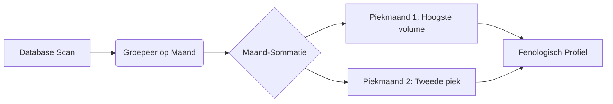

# BSI Score: Wetenschappelijke Verfijning (v3.3)

Dit document beschrijft de "Regionale Baseline" methode, waarbij de volledige historische inspanning van een telpost-cluster wordt gebruikt als ijkpunt.

## 1. De "Giga-Baseline" (15.800h Methode)
Om te voorkomen dat zeldzaamheden een te hoge norm krijgen (zoals de Slangenarend-paradox), berekent de app nu een absolute baseline over de gehele geschiedenis van de regio.

### Mathematische Precisie-Query:
De AI voert nu een "Giga-Scan" uit die de volgende variabelen berekent:
*   **Total Cluster Effort ($E_{total}$):** De som van álle geregistreerde teluren (bijv. 15.800 uur).
*   **Total Species Yield ($Y_{species}$):** Het totale aantal exemplaren van een soort over alle jaren (bijv. 51.231 Aalscholvers).
*   **Global BpH Index:** De absolute regionale norm ($Y_{species} / E_{total}$).
    *   *Resultaat:* 51.231 / 15.800 = **3,24 ex/h**.

## 2. Dynamische Piek-Analyse
De BSI-motor begrijpt nu ook het jaarritme van de soort door de maandelijkse verdeling te analyseren.

### Hoe dit de BSI-score stuurt:
1.  **Buiten Piekperiodes:** Als een soort wordt gezien buiten zijn top-maanden, wordt de BSI-score (sterren) automatisch verzwaard. De teller wordt extra beloond voor de "vroege" of "late" waarneming.
2.  **Tijdens de Piek:** De norm ligt op zijn hoogst; de teller moet hard werken (hoge CPUE) om de 5 sterren te verdienen.

## 3. De "Zero-Inflated" Correctie
De belangrijkste wijziging in v3.3 is dat de app nu ook rekent met de uren waarin een soort **niet** is gezien.
*   **Oude methode:** Gemiddelde van de dagen waarop de vogel er was.
*   **Nieuwe methode:** Totaal aantal vogels / Totaal aantal uren dat er geteld is (ook de lege uren).

---
> [!TIP]
> Door deze aanpak wordt een Slangenarend (1 ex op 15.800h) mathematisch gezien **52.488 keer zeldzamer** dan een Aalscholver. Dit vertaalt zich direct in een eerlijke en indrukwekkende sterren-score in je verslagen.
