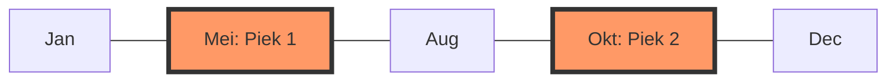

# BSI Score: Wetenschappelijke Verfijning (v3.5)

Dit document beschrijft de implementatie van de **Gaussische Fenologie-modellen** voor een nauwkeurige piek-analyse in de voor- en najaarstrek.

## 1. De Gaussische Piek-analyse (Klok-curve)
In plaats van een simpele datum-range, berekent de BSI-motor nu de **Fenologische Piek-curve** op basis van de historische uurs-intensiteit.

### Mathematisch Model:
Voor zowel de Voorjaarstrek ($V$) als de Najaarstrek ($N$) wordt een aparte Normaalverdeling berekend:
$$f(x) = a \cdot e^{-\frac{(x-\mu)^2}{2\sigma^2}}$$

*   **$\mu$ (Mu):** De absolute piekdagen (de "top van de klok").
*   **$\sigma$ (Sigma):** De spreiding van de trek (de "breedte van de klok").
*   **$x$:** De huidige teldag.

## 2. Visuele Integratie: In-line Sparklines
In de CardView van elke soort wordt een mini-grafiek (Sparkline) getekend die het jaarritme weergeeft.

*   **Top 1 (Voorjaar):** Gebaseerd op data van Jan-Jun.
*   **Top 2 (Najaar):** Gebaseerd op data van Jul-Dec.
*   **Real-time Marker:** Een indicator toont de positie van de huidige teldag op deze curves.

## 3. Dynamische BpH-Weging
De BSI-score wordt nu beïnvloed door de positie op de curve:
1.  **Summit (Top):** De norm ($BpH_{baseline}$) wordt gecorrigeerd naar het historische maximum. De teller moet maximaal presteren voor 5 sterren.
2.  **Tail (Flank):** De norm wordt verlaagd. Een vogel die in de "staart" van de curve wordt gezien, is statistisch zeldzamer en levert sneller extra sterren op.

---
> [!TIP]
> De naam van dit systeem is de **Double-Peak Gaussian Distribution**. Het stelt de app in staat om per soort te "begrijpen" of een waarneming midden in de hoofdmacht valt of een vroege/late pionier betreft.
