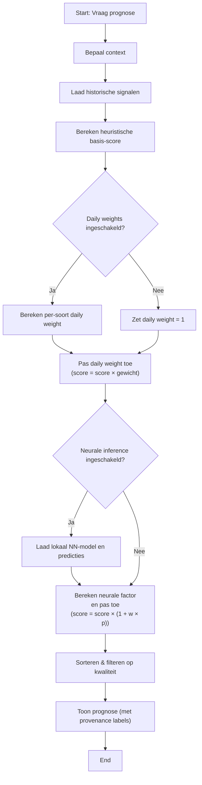
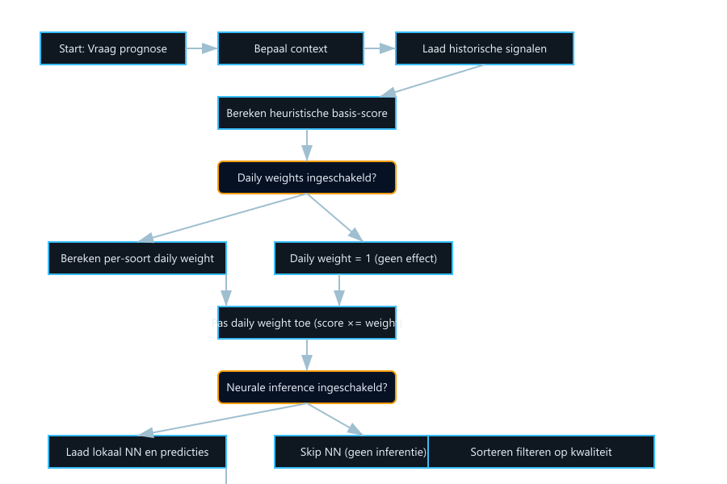

# BSI — Uitleg van Neural Integratie en Gebruik van Teldag‑Verslagen

Deze handleiding beschrijft hoe de on‑device BSI (Bio‑Statistische Intelligentie) voorspellingen vanaf nu werken
wanneer zowel het neurale model als de teldag‑verslagen (daily analysis) worden gebruikt. De tekst is bedoeld voor
gebruikers en testers — geen codevoorbeelden. Lees dit als een stap‑voor‑stap verklaring van wat er gebeurt wanneer
je een prognose vraagt.

## Doel

Het doel van deze uitbreiding is om prognoses beter aan te laten sluiten op wat er daadwerkelijk in het veld gebeurt.
Daartoe combineren we: bestaande heuristieken (seizoensprofielen, wind, tijd, etc.), een lokaal getraind neuraal model en
de reconstructies uit de teldag‑verslagen. De oorspronkelijke heuristiek blijft altijd de basis; nieuwe signalen werken als
gecontroleerde versterkers zodat voorspellingen zowel uitlegbaar als veiliger blijven.

## Wat bekijkt het systeem op het moment van een voorspelling

Bij iedere prognose (bijv. +3 dagen) beoordeelt het systeem de volgende aspecten:

- Huidige/simulatiecondities: datum, uur, temperatuur, luchtdruk, windrichting, windsnelheid, neerslag en telpost‑locatie.
- Seizoensprofielen: welke soorten zijn historisch vaak aanwezig in deze periode van het jaar.
- Wind‑ en corridorcondities: of de huidige windrichting/sterkte historisch gunstig zijn voor bepaalde soorten.
- Weather‑twins: uren uit het verleden met vergelijkbare wind‑/weersignatuur en de bijbehorende soorten.
- Gisteren‑factor: ruwe aanwijzing hoeveel vogels er gisteren waren (indien beschikbaar).

Deze signalen vormen samen een 'heuristische basis‑score' per soort — een betrouwbare basis die al lange tijd gebruikt wordt.

## Hoe teldag‑verslagen (daily analysis) worden gebruikt

De teldag‑verslagen zijn achteraf‑reconstructies die vertellen welke soorten op welke dag en telpost daadwerkelijk gezien
zijn. We gebruiken ze op twee plaatsen:

1) Tijdens training: voorbeelden van soorten krijgen extra gewicht als die soort frequent voorkomt in recente teldag‑verslagen.
   Dit betekent dat het neurale model sterker leert van bevestigde waarnemingen.

2) Tijdens live‑voorspelling: we berekenen voor elke soort een multiplicatieve factor op basis van hoe vaak die soort in de
   recente teldag‑verslagen voorkomt. Deze factor is minimaal 1.0 (geen effect) en loopt op tot een ingestelde maximumwaarde.
   De heuristische score wordt eerst met deze factor vermenigvuldigd — waardoor soorten die in de reconstructies vaak zijn
   bevestigd een hogere positie krijgen.

Kort: teldag‑verslagen zorgen ervoor dat zowel het leerproces als de live‑scores expliciet rekening houden met wat er echt gezien is.

## Hoe het neurale model en de heuristiek samenkomen

De volgorde van berekening is bewust eenvoudig en uitlegbaar:

1. Bereken de heuristische basis‑score voor elke soort op basis van tijd, weer, wind‑match, massa, etc.
2. Pas de dagelijkse‑gewicht‑factor toe (afgeleid uit teldag‑verslagen). Deze vermenigvuldigt de heuristieke score.
3. Pas vervolgens een neurale boost toe: het lokale neurale model geeft voor elke soort een kansscore; die wordt omgezet in
   een multiplicatieve factor (1 + gewicht × kans). De invloed van het neurale model is beheersbaar met een weegparameter
   (standaard gematigd), zodat de heuristiek altijd de stabiele basis blijft.

Dit resulteert in een uiteindelijke, gerangschikte lijst van soorten. De opbouw is zodanig dat je altijd kunt teruggaan
naar de heuristiek alleen (als je de extra signalen uitzet).

---

## Visueel overzicht (flowchart)

Hieronder vind je een eenvoudige flowchart van de beslisstroom voor een prognose. Je kunt deze in een Markdown‑viewer die Mermaid ondersteunt plakken en renderen.

Als Mermaid niet beschikbaar is, gebruik onderstaand ASCII‑schets:

Start -> Bepaal context -> Laad historische signalen -> Bereken heuristiek -> (daily enabled?) -> pas daily weight -> (neural enabled?) -> pas neural boost -> sorteer -> toon resultaten

---

### Ingesloten flowchart (SVG)

Als je editor Mermaid niet rendert, probeer dan de embedded SVG hieronder. De afbeelding wordt getoond in de meeste editors
wanneer je het Markdownbestand opent vanuit de `docs/` map.

<!-- Show the PNG directly so editors that don't render embedded SVG or Mermaid still display the flowchart. -->

---

## Kleurcodering (hoe je resultaten interpreteert)

- Groen: sterke, door meerdere signalen ondersteunde voorspellingen (hoog heuristiek + daily‑weight + hoge neurale kans).
- Geel: middelmatige ondersteuning (één sterk signaal of meerdere zwakke signalen).
- Rood: laag vertrouwen (laag heuristiek, geen confirmatie in teldag‑verslagen en lage neurale kans).

In de UI kan een combinatiekaartje of kleine badge aangeven welke bronnen een soort hebben versterkt: bijvoorbeeld
`[H]` voor Heuristiek, `[D]` voor Daily‑weights, `[N]` voor Neural — zo zie je meteen waarom een soort bovenaan staat.

---

## Instellingen en besturing

In het Instellingen‑scherm vind je nu twee relevante toggles:

- "Gebruik neurale prognose (Neural inference)": globale aan/uit‑schakelaar voor het neurale model.
- "Gebruik teldag‑verslagen in AI (Daily analysis weights)": aan/uit voor het gebruiken van de reconstructies als gewicht.

Standaard zijn beide opties ingeschakeld. Als je één van beide uitschakelt, dan wordt die bron genegeerd en valt het
gedrag terug op de resterende signalen.

## Veiligheidsmaatregelen en terugval

- Als er geen teldag‑verslagen beschikbaar zijn, gebeurt er niets — de dagelijkse factor is 1.0 en heeft geen effect.
- Als het neurale model ontbreekt of niet compatibel is, gebruikt het systeem alleen de heuristiek (zodat voorspellingen
  altijd blijven werken).
- De neurale bijdrage is bewust gematigd (je kunt de weging aanpassen), zodat het systeem niet plotseling onverklaarbare
  voorspellingen geeft.

## Wat zie je in de app of de logs wanneer de functie actief is

- In Logcat verschijnen regels die aangeven dat daily‑weights zijn berekend en toegepast (bijv. "Computed species weights..."
  en "DAILY‑WEIGHT: <soortid> weight=1.XXX").
- Als het neurale model geladen is, zie je ook iets als "Neural integration: loaded model with N outputs." en "NN BOOST: ..." per soort.
- In het prognose‑scherm wordt bij vergelijkingsweergaven (prototype vs baseline) zichtbaar welke soorten door welk
  mechanisme een boost kregen.

## Eenvoudig rekenvoorbeeld (ter illustratie)

Stel een heuristieke score voor soort X = 10.
- Daily‑weight (op basis van teldag‑verslagen) = 2.0 → tussentotaal = 10 × 2.0 = 20.
- Neuraal model voorspelt kans = 0.30 en de neurale weging = 0.5 → neurale factor = 1 + 0.5 × 0.30 = 1.15.
- Eindscore = 20 × 1.15 = 23.

Soorten zonder confirmatie in de teldag‑verslagen behouden weight = 1.0 en kunnen alleen door de neurale kans nog licht stijgen.

## Aanbevelingen voor testen en evaluatie

- Voer A/B‑tests uit: vergelijk voorspellingen met en zonder daily‑weights voor meerdere dagen achter elkaar.
- Gebruik de teldag‑verslagen als objectieve evaluatie: hoe vaak staat de daadwerkelijk bevestigde soort in de top‑N
  van de voorspelling (met vs zonder prototype)?
- Overweeg tijdelijk caching van de daily‑weights tijdens interactieve sessies (enkele minuten) om latency te verminderen.

## Conclusie

Met deze aanpassingen wordt de BSI‑prognose sterker afgestemd op wat er echt gebeurt in het veld: de reconstructies uit
de teldag‑verslagen worden zowel gebruikt om het lokale neurale model te sturen als direct toegepast als multiplicatieve
boost tijdens voorspellingen. De klassieke regels blijven de basis en nieuwe signalen werken als uitlegbare, veilige
versterkers.

Als je wilt kan ik deze handleiding uitbreiden met een korte sectie over wat je precies in Logcat zoekt voor debug/QA of
een checklist om experimenten systematisch uit te voeren.
